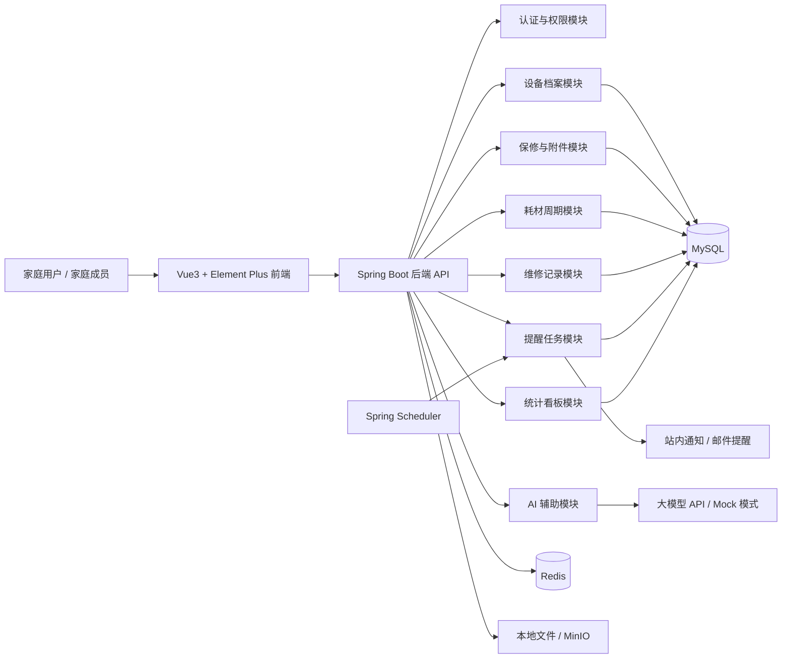

<div align="center">

**FixLedger 家庭设备保修与耗材管理系统** - 管理家庭设备、保修凭证、维修记录和耗材更换提醒的生活化工具

[](https://openjdk.org/)
[](https://spring.io/projects/spring-boot)
[](https://vuejs.org/)
[](https://www.typescriptlang.org/)
[](https://www.mysql.com/)
[](https://redis.io/)

</div>

---

## 项目介绍

FixLedger 是一个面向家庭家电和数码设备的保修、维修、耗材更换管理系统。

在日常生活中，手机、电脑、耳机、路由器、净水器、空气净化器、洗衣机、冰箱等设备的购买渠道分散，发票、保修卡、说明书、维修记录也经常散落在不同平台或文件夹中。等设备出现故障或需要更换耗材时，常常会遇到这些问题：

- 不知道设备是否还在保修期内。
- 找不到发票、保修卡或维修凭证。
- 不记得上次维修、更换滤芯或更换电池是什么时候。
- 说明书、售后电话、维修记录没有统一入口。
- 家庭设备越来越多，但缺少完整的设备生命周期记录。

FixLedger 希望解决这个生活中的小问题：把家庭设备档案、购买凭证、保修期限、耗材周期、维修记录和提醒任务统一管理起来，让家庭设备的使用、维修和报废过程都有迹可循。

AI 在本项目中不是主题，而是辅助能力：用于从发票文本中提取设备信息、根据故障描述生成排查建议、根据维修记录生成维护总结。即使不使用 AI，系统的核心业务也可以独立运行。

## 项目动机

做这个项目的原因很简单：家里设备越来越多，但没有一个轻量、统一、适合个人和家庭使用的设备档案工具。

不同品牌设备通常会有各自的 App，但它们只管理自家设备；电商平台能查订单，但不适合长期记录维修和耗材更换；文件夹能保存发票，但不能提醒保修到期或滤芯更换。FixLedger 的目标不是做一个复杂的企业资产管理系统，而是做一个更贴近日常生活的家庭设备管理工具。

从技术角度看，这个项目也能覆盖 Java Web 开发中比较常见的能力：用户认证、权限控制、文件上传、定时提醒、状态流转、Redis 缓存、统计报表、前后端分离和 AI 辅助处理。

## 系统架构



## 技术栈

### 后端技术

| 技术 | 版本 | 说明 |
| --- | --- | --- |
| Java / JDK | 21+ | 后端开发语言（LTS，配合 Spring Boot 3.x 使用） |
| Spring Boot | 3.x | 应用开发框架（生态成熟，兼容 JDK 21） |
| Spring Web | 3.x | RESTful API |
| Spring Security | 6.x | 登录认证与接口鉴权 |
| JWT | - | 无状态登录凭证 |
| MyBatis Plus | 3.5.x | ORM 与基础 CRUD 能力 |
| MySQL | 8.x | 业务数据存储 |
| Redis | 7.x | 验证码、提醒去重、热点数据缓存 |
| Spring Scheduler | - | 保修到期、耗材更换等定时提醒 |
| Spring Validation | - | 参数校验 |
| SpringDoc OpenAPI / Knife4j | - | API 接口文档 |
| Lombok | - | 简化实体类和 DTO 编写 |
| MapStruct | - | DTO / Entity 映射 |
| MinIO / 本地文件存储 | - | 发票、保修卡、说明书、维修单附件 |
| Spring AI / 自定义 AI Client | - | AI 信息提取与辅助分析 |
| Maven | 3.9+ | 构建工具 |

技术选型说明：

1. 后端采用 JDK 21 + Spring Boot 3.x：JDK 21 是 LTS 版本，适合在简历项目中体现较新的 Java 实践；Spring Boot 3.x 生态更成熟，和 MyBatis Plus、Spring Security、Knife4j、Redis 等常用组件的兼容性更稳。
2. 数据库选择 MySQL，是因为家庭设备、保修、维修、提醒等数据关系明确，适合关系型建模，也贴合常见 Java 项目开发环境。
3. 引入 Redis 主要用于验证码、登录态辅助缓存、提醒任务去重、首页统计缓存等场景，避免重复提醒和频繁查询数据库。
4. 文件存储第一版可以使用本地文件系统，后续可切换为 MinIO，适合保存发票图片、保修卡、说明书 PDF、维修单等附件。
5. AI 模块采用可替换的 Client 设计，可以接入兼容 OpenAI 风格的 API，也可以在本地开发阶段使用 Mock 模式，避免 AI 接口影响核心业务。

### 前端技术

| 技术 | 版本 | 说明 |
| --- | --- | --- |
| Vue | 3.x | 前端 UI 框架 |
| TypeScript | 5.x | 前端开发语言 |
| Vite | 5.x | 前端构建工具 |
| Element Plus | 2.x | 后台管理组件库 |
| Vue Router | 4.x | 路由管理 |
| Pinia | 2.x | 状态管理 |
| Axios | 1.x | HTTP 请求客户端 |
| ECharts | 5.x | 统计图表 |
| Day.js | 1.x | 日期处理 |

## 功能特性

### 家庭空间模块

- **家庭空间管理**：支持创建家庭空间，将设备、提醒和维修记录按家庭维度聚合。
- **家庭成员管理**：支持邀请家庭成员加入，后续可扩展成员角色和权限。
- **数据隔离**：不同家庭空间之间的数据互相隔离，避免设备和凭证混杂。

### 设备档案模块

- **设备信息管理**：记录设备名称、品牌、型号、序列号、购买日期、购买渠道、购买价格、存放位置等信息。
- **设备分类管理**：支持家电、数码、网络设备、厨房设备、清洁设备等分类。
- **设备状态流转**：支持正常使用、待维修、维修中、已维修、闲置、已报废等状态。
- **设备生命周期**：围绕一台设备聚合展示保修、耗材、维修、附件和提醒记录。

### 保修与附件模块

- **保修期限管理**：记录保修开始日期、保修结束日期、保修类型和售后联系人。
- **即将过保提醒**：支持提前 7 天、30 天等规则提醒设备即将过保。
- **凭证附件管理**：支持上传发票、保修卡、说明书、维修单、售后截图等文件。
- **附件归档查看**：在设备详情页集中查看该设备相关凭证，避免临时查找。

### 耗材管理模块

- **耗材周期配置**：为净水器滤芯、空气净化器滤网、扫地机器人配件、电池等配置更换周期。
- **更换提醒**：根据上次更换时间和周期自动生成提醒任务。
- **更换记录**：记录耗材名称、品牌、费用、更换日期、下次提醒日期。
- **临期看板**：首页展示即将到期和已超期未更换的耗材。

### 维修记录模块

- **故障记录**：记录故障描述、发生时间、设备状态、是否保内、维修渠道等信息。
- **维修过程跟踪**：支持待处理、已报修、维修中、已完成、已取消等状态。
- **维修费用统计**：统计设备维修成本，辅助判断是否继续维修或报废。
- **维修历史归档**：每台设备保留完整维修历史，方便后续排查同类问题。

### 提醒与通知模块

- **定时扫描任务**：基于 Spring Scheduler 定期扫描保修到期和耗材更换任务。
- **提醒去重**：使用 Redis 记录提醒发送标识，避免同一事项重复提醒。
- **站内通知**：系统内展示即将过保、耗材到期、维修待跟进等通知。
- **通知扩展**：后续可扩展邮件、企业微信、Webhook 等通知方式。

### AI 辅助模块

- **票据信息提取**：用户粘贴发票文本后，AI 辅助提取设备名称、购买日期、价格、商家等字段。
- **故障排查建议**：根据设备类型和故障描述，生成初步排查思路和处理建议。
- **维修记录总结**：根据多次维修记录总结常见故障、累计费用和维护建议。
- **AI Mock 模式**：开发和测试时可以使用 Mock 返回结果，避免依赖真实 AI 服务。

### 统计看板模块

- **设备总览**：展示设备总数、即将过保数量、待更换耗材数量、维修中设备数量。
- **费用统计**：统计购买金额、维修费用、耗材费用等数据。
- **分类分布**：按设备分类、品牌、使用状态统计家庭设备情况。
- **提醒日历**：以日历形式查看未来保修到期和耗材更换计划。

## TODO

### MVP 阶段

- [x] 后端基础脚手架搭建：Spring Boot、MySQL、Redis。
- [x] 用户注册、登录、JWT 认证与基础权限控制。
- [x] 家庭空间、家庭成员、设备分类和设备档案管理。
- [x] 保修记录、附件上传和设备详情聚合页后端能力。
- [x] 耗材周期配置、耗材更换记录和提醒任务。
- [x] 维修记录管理和维修状态流转。
- [x] 首页统计看板和临期提醒列表后端能力。
- [x] OpenAPI 接口文档。
- [x] Vue3 前端 MVP 页面：登录注册、首页看板、设备档案、保修、耗材、维修、提醒、附件和 AI 助手。

### 增强阶段

- [x] Redis 提醒去重和首页热点统计缓存。
- [x] AI 票据信息提取、故障排查建议和维修总结。
- [ ] MinIO 文件存储适配。
- [ ] 邮件或 Webhook 通知扩展。
- [ ] 操作日志与关键操作审计。
- [x] Docker Compose 一键启动前端、后端、MySQL 和 Redis。
- [x] 后端单元测试和接口测试。

### 后续计划

- [ ] 支持说明书 PDF 文本解析和全文搜索。
- [ ] 支持家庭网络设备在线检测。
- [ ] 支持移动端适配或小程序端。
- [ ] 支持设备二维码标签，扫码查看设备档案。
- [ ] 支持导出家庭设备资产清单和维修费用报表。

## 效果展示

当前仓库已完成前端 MVP 页面，后续联调稳定后可补充实际截图。已实现页面包括：

### 设备管理

- 首页看板：设备总数、即将过保、耗材到期、维修中设备。
- 设备列表：按分类、状态、品牌、保修状态筛选设备。
- 设备详情：集中展示基础信息、保修凭证、耗材周期、维修历史和附件。

### 保修与耗材

- 保修日历：查看未来即将过保的设备。
- 耗材提醒：查看即将更换和已超期的耗材。
- 更换记录：记录滤芯、滤网、电池等耗材更换历史。

### 维修与 AI 辅助

- 维修记录：记录故障、报修、维修过程和费用。
- AI 排查建议：根据故障描述生成初步排查思路。
- 维护总结：根据设备历史记录生成维护建议。

## 项目结构

计划目录结构如下：

```text
fix-ledger/
├── backend/                           # Spring Boot 后端应用
│   ├── src/main/java/com/fixledger/
│   │   ├── FixLedgerApplication.java  # 后端启动类
│   │   ├── common/                    # 通用能力
│   │   │   ├── config/                # 配置类
│   │   │   ├── exception/             # 全局异常处理
│   │   │   ├── result/                # 统一响应结构
│   │   │   ├── security/              # 安全认证
│   │   │   └── utils/                 # 工具类
│   │   ├── infrastructure/            # 基础设施
│   │   │   ├── ai/                    # AI Client 与 Prompt
│   │   │   ├── file/                  # 文件存储
│   │   │   ├── redis/                 # Redis 服务
│   │   │   └── scheduler/             # 定时任务
│   │   └── modules/                   # 业务模块
│   │       ├── auth/                  # 登录认证
│   │       ├── family/                # 家庭空间
│   │       ├── asset/                 # 设备档案
│   │       ├── warranty/              # 保修记录
│   │       ├── consumable/            # 耗材管理
│   │       ├── maintenance/           # 维修记录
│   │       ├── reminder/              # 提醒任务
│   │       ├── dashboard/             # 统计看板
│   │       └── system/                # 系统管理
│   └── src/main/resources/
│       ├── application.yml            # 应用配置
│       ├── mapper/                    # MyBatis XML
│       └── prompts/                   # AI 提示词模板
│
├── frontend/                          # Vue3 前端应用
│   ├── src/
│   │   ├── api/                       # API 请求
│   │   ├── assets/                    # 静态资源
│   │   ├── components/                # 公共组件
│   │   ├── layouts/                   # 页面布局
│   │   ├── router/                    # 路由配置
│   │   ├── stores/                    # Pinia 状态
│   │   ├── types/                     # TypeScript 类型
│   │   ├── utils/                     # 工具函数
│   │   └── views/                     # 页面组件
│   ├── package.json
│   └── vite.config.ts
│
├── docs/                              # 项目文档
│   ├── requirements.md                # 需求说明
│   ├── architecture.md                # 架构设计
│   ├── api.md                         # 接口设计
│   ├── database.md                    # 数据库设计
│   ├── ui.md                          # 页面与交互设计
│   └── tasks.md                       # 开发任务拆分
│
├── docker-compose.yml                 # Docker 编排
├── .env.example                       # 环境变量示例
├── AGENTS.md                          # Codex 协作说明
└── README.md
```

## 快速开始

环境要求（本地开发方式）：

| 依赖 | 版本 | 必需 | 说明 |
| --- | --- | --- | --- |
| JDK | 21+ | 是 | 后端运行环境，项目采用 JDK 21 + Spring Boot 3.x |
| Maven | 3.9+ | 是 | 后端构建工具 |
| Node.js | 18+ | 是 | 前端运行环境 |
| npm | 10+ | 是 | 前端包管理器，随 Node.js 安装 |
| MySQL | 8.x | 是 | 业务数据库 |
| Redis | 7.x | 推荐 | 缓存与提醒去重 |
| Docker | - | 推荐 | 一键启动完整项目 |

如果使用 Docker 一键启动，只需要 Docker Desktop；JDK、Maven、Node.js、MySQL 和 Redis 是本地开发方式需要。

### 1. 克隆项目

```bash
git clone <your-repository-url>
cd fix-ledger
```

### 2. 配置环境变量

```bash
cp .env.example .env
```

`.env` 示例：

```dotenv
SPRING_PROFILES_ACTIVE=dev
SERVER_PORT=8080
BACKEND_PORT=8080
FRONTEND_PORT=5173

MYSQL_HOST=localhost
MYSQL_PORT=3306
MYSQL_DATABASE=fixledger
MYSQL_USERNAME=fixledger
MYSQL_PASSWORD=fixledger_dev_password
MYSQL_ROOT_PASSWORD=root_password

REDIS_HOST=localhost
REDIS_PORT=6379
REDIS_PASSWORD=
REDIS_DATABASE=0

JWT_SECRET=replace-with-at-least-32-byte-development-secret
JWT_ACCESS_TOKEN_TTL_SECONDS=86400

FILE_STORAGE_ROOT=./uploads
FILE_MAX_SIZE=20MB
FILE_MAX_REQUEST_SIZE=25MB

SQL_INIT_MODE=always
SQL_DATA_LOCATIONS=classpath:db/demo-data.sql

AI_ENABLED=false
AI_PROVIDER=mock
AI_API_KEY=
AI_BASE_URL=
AI_MODEL=
```

### 3. 启动依赖服务

可以通过 Docker 启动 MySQL 和 Redis：

```bash
docker compose up -d mysql redis
```

如需同时初始化演示数据，可以在 `.env` 中设置：

```dotenv
SQL_INIT_MODE=always
SQL_DATA_LOCATIONS=classpath:db/demo-data.sql
```

### 4. 启动后端

```bash
cd backend
mvn spring-boot:run
```

后端服务默认启动于：

```text
http://localhost:8080
```

健康检查与接口文档地址：

```text
http://localhost:8080/actuator/health
http://localhost:8080/swagger-ui.html
http://localhost:8080/v3/api-docs
```

演示账号：

```text
用户名：demo
密码：fixledger123
默认家庭空间 ID：1
```

### 5. 启动前端

```bash
cd frontend
npm install
npm run dev
```

前端服务默认启动于：

```text
http://localhost:5173
```

## Docker 快速部署

Docker Compose 现在默认编排前端、后端、MySQL 和 Redis，适合面试演示时一条命令拉起完整系统。前端容器通过 Nginx 代理 `/api` 到后端容器，浏览器只需要访问前端地址。

| 服务 | 地址 | 默认账号 | 默认密码 | 说明 |
| --- | --- | --- | --- | --- |
| 前端页面 | `http://localhost:5173` | `demo` | `fixledger123` | Vue3 + Nginx |
| 后端 API | `http://localhost:8080` | - | - | Spring Boot 服务 |
| 接口文档 | `http://localhost:8080/swagger-ui.html` | - | - | OpenAPI UI |
| MySQL | `localhost:3306` | `fixledger` | `fixledger_dev_password` | 业务数据库 |
| Redis | `localhost:6379` | - | - | 缓存和提醒去重 |

常用命令：

```bash
# 构建并启动前端、后端、MySQL、Redis
docker compose up -d --build

# 查看服务状态
docker compose ps

# 查看后端日志
docker compose logs -f backend

# 查看前端日志
docker compose logs -f frontend

# 停止服务但保留数据
docker compose down

# 停止服务并清除数据卷，慎用
docker compose down -v
```

首次构建会拉取 MySQL、Redis、Maven/JDK、Node.js 和 Nginx 基础镜像，并在镜像内下载 Maven 与 npm 依赖。如果 Docker Hub 网络超时或认证失败，需要先在 Docker Desktop 配置镜像加速或代理；也可以在 `.env` 中覆盖 `MAVEN_IMAGE`、`JRE_IMAGE`、`NODE_IMAGE`、`NGINX_IMAGE` 为可访问的镜像仓库地址，然后重新执行 `docker compose up -d --build`。

## 使用场景

| 用户角色 | 使用场景 |
| --- | --- |
| 家庭用户 | 统一记录家电、数码设备、发票、保修卡和说明书 |
| 家庭成员 | 查看设备信息、补充维修记录、接收耗材更换提醒 |
| 租房用户 | 管理租住房屋内的家电、维修记录和费用 |
| 数码爱好者 | 管理电脑、手机、相机、耳机等设备的购买和维修历史 |
| 家庭负责人 | 统计家庭设备资产、维护费用和即将到期事项 |

## 常见问题

### Q: 这个项目和普通资产管理系统有什么区别？

FixLedger 的定位更生活化，核心不是企业固定资产盘点，而是家庭设备的保修、维修、耗材更换和凭证归档。它关注的是设备买回来之后，在日常使用过程中的保修到期、维修记录、耗材周期和家庭成员协作。

### Q: 为什么要做 AI 功能？

AI 只是辅助能力，不参与核心业务判断。它主要用于减少手动录入和整理成本，例如从发票文本中提取设备信息，根据故障描述生成排查建议，或者根据维修记录生成维护总结。即使关闭 AI，设备档案、保修提醒、耗材提醒和维修记录仍然可以正常使用。

### Q: 第一版需要 OCR 吗？

不需要。第一版可以先支持用户上传发票图片并手动录入信息，或者粘贴发票文本后让 AI 提取字段。OCR 可以作为后续增强能力接入，避免一开始引入过多复杂度。

### Q: 提醒任务如何避免重复通知？

后端通过 Spring Scheduler 定时扫描即将过保和耗材到期的数据，生成提醒任务。Redis 用于记录近期已发送的提醒标识，例如 `reminder:warranty:deviceId:date`，避免同一天重复发送相同提醒。

### Q: 文件存储怎么设计？

开发阶段可以使用本地文件存储，保存发票、保修卡、说明书和维修单。为了后续扩展，文件模块会抽象统一接口，后续可切换到 MinIO 或其他 S3 兼容对象存储。

### Q: 这个项目如何体现 Java 后端能力？

项目会覆盖 Spring Boot 分层开发、MyBatis Plus 数据访问、Spring Security + JWT 认证、Redis 缓存、定时任务、文件上传、状态流转、统计报表、统一异常处理、接口文档和 Docker 部署等内容，不是单纯的增删改查。

## 贡献

欢迎提交 Issue 和 Pull Request。建议在提交功能前先补充对应的需求说明、接口说明和数据库设计，保持文档与代码同步。

## 许可证

MIT License


