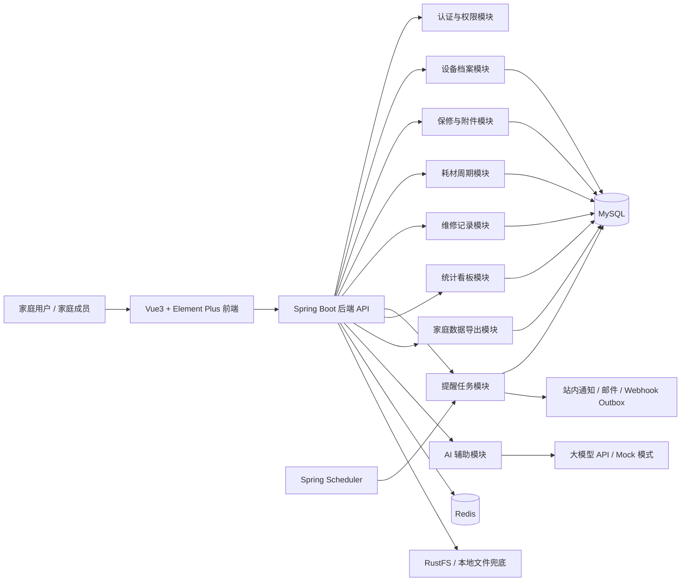

<div align="center">

**FixLedger 家庭设备保修与耗材管理系统** - 管理家庭设备、保修凭证、维修记录和耗材更换提醒的生活化工具

[](https://openjdk.org/)
[](https://spring.io/projects/spring-boot)
[](https://vuejs.org/)
[](https://www.typescriptlang.org/)
[](https://www.mysql.com/)
[](https://redis.io/)

</div>

---


## 文档导航

如果你是第一次阅读项目，建议按下面顺序理解：

| 文档 | 作用 |
| --- | --- |
| `docs/spec.md` | 项目级规格：目标、技术栈、命令、结构、代码风格、测试策略、边界和成功标准 |
| `docs/requirements.md` | 需求说明：项目背景、用户、功能范围和验收标准 |
| `docs/architecture.md` | 架构设计：分层、模块、数据流、Redis、AI、文件存储和部署 |
| `docs/api.md` | 接口设计：统一响应、认证、分页、错误码和各模块 API |
| `docs/database.md` | 数据库设计：表结构、索引、枚举、演示数据和 RustFS 元数据存储方式 |
| `docs/ui.md` | UI 设计：我的家、家庭日历、设备档案、凭证盒和智能助手 |
| `docs/demo-guide.md` | P14-P24 演示指南：一键启动、演示账号、数据地图、5-10 分钟路线和排障预案 |
| `docs/tasks.md` | 开发留痕：阶段计划、验收、验证记录和后续任务 |
| `docs/security-test-review.md` | P9 测试与安全审查：认证、权限、文件、JWT、日志等风险控制证据 |
| `docs/interview-guide.md` | 面试讲解指南：项目背景、技术栈、架构、数据库、Docker、AI、Redis 和演示路线 |
| `docs/operations.md` | 生产运维：监控、迁移、HTTPS、备份恢复、发布与回滚 |
| `docs/decisions/` | ADR：核心技术栈、RustFS、AI 辅助定位、家庭场景 UI 等关键决策 |

`AGENTS.md` 是项目编码规范和边界约束；README 面向运行、展示和面试讲解。
## 项目介绍

FixLedger 是一个面向家庭家电和数码设备的保修、维修、耗材更换管理系统。

在日常生活中，手机、电脑、耳机、路由器、净水器、空气净化器、洗衣机、冰箱等设备的购买渠道分散，发票、保修卡、说明书、维修记录也经常散落在不同平台或文件夹中。等设备出现故障或需要更换耗材时，常常会遇到这些问题：

- 不知道设备是否还在保修期内。
- 找不到发票、保修卡或维修凭证。
- 不记得上次维修、更换滤芯或更换电池是什么时候。
- 说明书、售后电话、维修记录没有统一入口。
- 家庭设备越来越多，但缺少完整的设备生命周期记录。

FixLedger 希望解决这个生活中的小问题：把家庭设备档案、购买凭证、保修期限、耗材周期、维修记录和提醒任务统一管理起来，让家庭设备的使用、维修和报废过程都有迹可循。

AI 在本项目中不是主题，而是辅助能力：用于从发票文本中提取设备信息、根据故障描述生成排查建议、根据维修记录生成维护总结。即使不使用 AI，系统的核心业务也可以独立运行。

## 项目动机

做这个项目的原因很简单：家里设备越来越多，但没有一个轻量、统一、适合个人和家庭使用的设备档案工具。

不同品牌设备通常会有各自的 App，但它们只管理自家设备；电商平台能查订单，但不适合长期记录维修和耗材更换；文件夹能保存发票，但不能提醒保修到期或滤芯更换。FixLedger 的目标不是做一个复杂的企业资产管理系统，而是做一个更贴近日常生活的家庭设备管理工具。

从技术角度看，这个项目也能覆盖 Java Web 开发中比较常见的能力：用户认证、权限控制、文件上传、定时提醒、状态流转、Redis 缓存、统计报表、前后端分离和 AI 辅助处理。

## 系统架构



## 技术栈

### 后端技术

| 技术 | 版本 | 说明 |
| --- | --- | --- |
| Java / JDK | 21+ | 后端开发语言（LTS，配合 Spring Boot 3.x 使用） |
| Spring Boot | 3.x | 应用开发框架（生态成熟，兼容 JDK 21） |
| Spring Web | 3.x | RESTful API |
| Spring Security | 6.x | 登录认证与接口鉴权 |
| JWT | - | 无状态登录凭证 |
| MyBatis Plus | 3.5.x | ORM 与基础 CRUD 能力 |
| MySQL | 8.x | 业务数据存储 |
| Redis | 7.x | 提醒去重、JWT 黑名单、首页短 TTL 摘要缓存；验证码为后续增强 |
| Spring Scheduler | - | 保修到期、耗材更换等定时提醒 |
| Spring Validation | - | 参数校验 |
| SpringDoc OpenAPI | 2.6.x | API 接口文档 |
| Lombok | - | 简化实体类和 DTO 编写 |
| MapStruct | - | DTO / Entity 映射 |
| RustFS / 本地文件存储 | - | Docker 默认使用 RustFS，本地存储保留为测试和兜底 |
| 自定义 AI Client | - | Mock 与 OpenAI-compatible Provider，AI 默认可关闭 |
| Maven | 3.9+ | 构建工具 |

技术选型说明：

1. 后端采用 JDK 21 + Spring Boot 3.x：JDK 21 是 LTS 版本，适合在简历项目中体现较新的 Java 实践；Spring Boot 3.x 生态更成熟，和 MyBatis Plus、Spring Security、Knife4j、Redis 等常用组件的兼容性更稳。
2. 数据库选择 MySQL，是因为家庭设备、保修、维修、提醒等数据关系明确，适合关系型建模，也贴合常见 Java 项目开发环境。
3. 当前引入 Redis 主要用于提醒任务去重、JWT 退出黑名单和首页 2 分钟摘要缓存；验证码和登录态辅助缓存是后续增强方向，Redis 异常时首页回源 MySQL。
4. 文件存储当前优先使用 RustFS 这类 S3 兼容对象存储，保留本地文件系统作为测试和兜底，适合保存发票图片、保修卡、说明书 PDF、维修单等附件。
5. AI 模块采用可替换的 Client 设计，可以接入兼容 OpenAI 风格的 API，也可以在本地开发阶段使用 Mock 模式，避免 AI 接口影响核心业务。

### 前端技术

| 技术 | 版本 | 说明 |
| --- | --- | --- |
| Vue | 3.x | 前端 UI 框架 |
| TypeScript | 5.x | 前端开发语言 |
| Vite | 6.x | 前端构建工具 |
| Element Plus | 2.x | Vue 组件库，当前按家庭场景二次组织页面体验 |
| Vue Router | 4.x | 路由管理 |
| Pinia | 2.x | 状态管理 |
| Axios | 1.x | HTTP 请求客户端 |
| ECharts | 5.x | 统计图表 |
| Day.js | 1.x | 日期处理 |

## 功能特性

### 家庭空间模块

- **家庭空间管理**：支持创建家庭空间，将设备、提醒和维修记录按家庭维度聚合。
- **家庭成员管理**：支持邀请已注册用户、调整角色、移除成员和成员权限校验。
- **数据隔离**：不同家庭空间之间的数据互相隔离，避免设备和凭证混杂。

### 设备档案模块

- **设备信息管理**：记录设备名称、品牌、型号、序列号、购买日期、购买渠道、购买价格、存放位置等信息。
- **设备分类管理**：新家庭空间会自动初始化数码设备、大家电、小家电、网络设备、厨房设备、清洁设备、家居设备和其他分类，也支持家庭内自定义分类。
- **设备状态流转**：支持正常使用、待维修、维修中、已维修、闲置、已报废等状态。
- **设备生命周期**：围绕一台设备聚合展示保修、耗材、维修、附件和提醒记录。

### 保修与附件模块

- **保修期限管理**：记录保修开始日期、保修结束日期、保修类型和售后联系人。
- **即将过保提醒**：支持提前 7 天、30 天等规则提醒设备即将过保。
- **凭证附件管理**：支持上传发票、保修卡、说明书、维修单、售后截图等文件。
- **附件归档查看**：在设备详情页集中查看该设备相关凭证，避免临时查找。

### 耗材管理模块

- **耗材周期配置**：为净水器滤芯、空气净化器滤网、扫地机器人配件、电池等配置更换周期。
- **更换提醒**：根据上次更换时间和周期自动生成提醒任务。
- **更换记录**：记录耗材名称、品牌、费用、更换日期、下次提醒日期。
- **临期看板**：首页展示即将到期和已超期未更换的耗材。

### 维修记录模块

- **故障记录**：记录故障描述、发生时间、设备状态、是否保内、维修渠道等信息。
- **维修过程跟踪**：支持待处理、已报修、维修中、已完成、已取消等状态。
- **维修费用统计**：统计设备维修成本，辅助判断是否继续维修或报废。
- **费用报表导出**：支持按家庭导出维修费用 CSV，方便离线复盘。
- **维修历史归档**：每台设备保留完整维修历史，方便后续排查同类问题。

### 提醒与通知模块

- **定时扫描任务**：基于 Spring Scheduler 定期扫描保修到期和耗材更换任务。
- **提醒去重**：使用 Redis 记录提醒发送标识，避免同一事项重复提醒。
- **站内通知**：系统内展示即将过保、耗材到期、维修待跟进等通知。
- **外部通知**：可选邮件和 Webhook 渠道，使用数据库 Outbox、失败重试和超时领取恢复。

### AI 辅助模块

- **票据信息提取**：用户粘贴发票文本后，AI 辅助提取设备名称、购买日期、价格、商家等字段。
- **故障排查建议**：根据设备类型和故障描述，生成初步排查思路和处理建议。
- **维修记录总结**：根据多次维修记录总结常见故障、累计费用和维护建议。
- **AI Mock 模式**：开发和测试时可以使用 Mock 返回结果，避免依赖真实 AI 服务。

### 统计看板模块

- **设备总览**：展示设备总数、即将过保数量、待更换耗材数量、维修中设备数量。
- **费用统计**：统计购买金额、维修费用、耗材费用等数据。
- **分类分布**：按设备分类、品牌、使用状态统计家庭设备情况。
- **提醒日历**：以日历形式查看未来保修到期和耗材更换计划。
- **数据导出**：支持导出家庭设备资产清单和维修费用报表。

## 项目进度

### MVP 阶段

- [x] 后端基础脚手架搭建：Spring Boot、MySQL、Redis。
- [x] 用户注册、登录、JWT 认证与基础权限控制。
- [x] 家庭空间、家庭成员、设备分类和设备档案管理。
- [x] 保修记录、附件上传和设备详情聚合页后端能力。
- [x] 耗材周期配置、耗材更换记录和提醒任务。
- [x] 维修记录管理和维修状态流转。
- [x] 首页统计看板和临期提醒列表后端能力。
- [x] OpenAPI 接口文档。
- [x] Vue3 前端 MVP 页面：登录注册、我的家首页、设备档案、保修、耗材、维修、提醒、凭证盒和智能助手。

### 增强阶段

- [x] Redis 提醒去重、JWT 黑名单和首页短 TTL 摘要缓存。
- [x] AI 票据信息提取、故障排查建议和维修总结。
- [x] RustFS 文件存储适配。
- [x] 邮件与 Webhook 通知扩展，默认关闭且不进入提醒事务。
- [x] 操作日志与关键操作审计。
- [x] Docker Compose 一键启动前端、后端、MySQL、Redis 和 RustFS。
- [x] 后端单元测试和接口测试。
- [x] 家庭设备资产清单和维修费用 CSV 导出。

### 后续计划

- [x] 支持说明书第一版关键词搜索和说明书文件名索引。
- [ ] 支持设备二维码标签，扫码查看设备档案。
- [ ] 支持说明书 OCR、发票图片识别和复杂 PDF 内容解析。
- [x] 支持移动端响应式布局、PWA 安装和不缓存业务数据的基础离线页。
- [x] 支持邮件、Webhook 等外部通知渠道。
- [ ] 支持家庭网络设备在线检测。

PWA 安装和离线页依赖 HTTPS 安全上下文；同设备 `localhost` 可使用 HTTP 调试，手机通过普通局域网 HTTP 地址访问时仍可使用响应式页面，但不会注册 Service Worker。

## 效果展示

P14 不把静态截图作为唯一展示依据，避免界面迭代后截图过期；推荐按 `docs/demo-guide.md` 现场演示。当前可演示页面和讲解重点如下：

| 页面 | 入口 | 演示重点 |
| --- | --- | --- |
| 登录页 | `http://localhost:5173/login` | 空表单 + “填入演示账号”按钮，说明演示账号不是生产密钥硬编码 |
| 我的家 | `/dashboard` | 家庭健康分、本周事项、提醒日历、设备总览和维修中设备 |
| 家庭日历 | `/dashboard?focus=calendar` | 保修到期和耗材更换提醒由后端任务生成，Redis 做去重 |
| 设备档案 | `/devices` | 按房间组织设备卡片墙，弱化普通后台表格感 |
| 设备详情 | `/devices/1` | 围绕一台设备聚合保修、耗材、维修、附件和 AI 总结 |
| 耗材管理 | `/consumables` | 记录滤芯/滤网更换，重新计算下次提醒日期 |
| 维修记录 | `/maintenance` | 展示维修状态流转、维修中设备、费用统计口径和费用报表导出 |
| 凭证盒 | `/files` | 按设备整理发票、说明书、保修、维修和耗材凭证，支持图片/PDF 预览，文件内容进入 RustFS |
| 智能助手 | `/ai-tools` | Mock AI 票据提取、故障建议和维修总结，失败不影响核心流程 |

演示建议：先用 `demo / fixledger123` 走 5 分钟核心路线，再按面试官问题打开 OpenAPI、Docker Compose、测试记录或 P13 安全审计记录。

## 项目结构

当前目录结构如下：

```text
fixledger/
├── backend/                           # Spring Boot 后端应用
│   ├── src/main/java/com/fixledger/
│   │   ├── FixLedgerApplication.java  # 后端启动类
│   │   ├── common/                    # 通用能力
│   │   │   ├── config/                # 配置类
│   │   │   ├── exception/             # 全局异常处理
│   │   │   ├── result/                # 统一响应结构
│   │   │   ├── security/              # 安全认证
│   │   │   └── utils/                 # 工具类
│   │   ├── infrastructure/            # 基础设施
│   │   │   ├── ai/                    # AI Client 与 Prompt
│   │   │   ├── file/                  # 文件存储
│   │   │   ├── redis/                 # Redis 服务
│   │   │   └── scheduler/             # 定时任务
│   │   └── modules/                   # 业务模块
│   │       ├── auth/                  # 登录认证
│   │       ├── family/                # 家庭空间
│   │       ├── asset/                 # 设备档案
│   │       ├── warranty/              # 保修记录
│   │       ├── consumable/            # 耗材管理
│   │       ├── maintenance/           # 维修记录
│   │       ├── reminder/              # 提醒任务
│   │       ├── dashboard/             # 统计看板
│   │       └── user/                  # 用户实体和用户状态
│   └── src/main/resources/
│       ├── application.yml            # 应用配置
│       ├── mapper/                    # MyBatis XML
│       └── prompts/                   # AI 提示词模板
│
├── frontend/                          # Vue3 前端应用
│   ├── src/
│   │   ├── api/                       # API 请求
│   │   ├── assets/                    # 静态资源
│   │   ├── components/                # 公共组件
│   │   ├── layouts/                   # 页面布局
│   │   ├── router/                    # 路由配置
│   │   ├── stores/                    # Pinia 状态
│   │   ├── types/                     # TypeScript 类型
│   │   ├── utils/                     # 工具函数
│   │   └── views/                     # 页面组件
│   ├── package.json
│   └── vite.config.ts
│
├── docs/                              # 项目文档
│   ├── requirements.md                # 需求说明
│   ├── architecture.md                # 架构设计
│   ├── api.md                         # 接口设计
│   ├── database.md                    # 数据库设计
│   ├── ui.md                          # 页面与交互设计
│   └── tasks.md                       # 开发任务拆分
│
├── docker-compose.yml                 # Docker 编排
├── .env.example                       # 环境变量示例
├── AGENTS.md                          # Codex 协作说明
└── README.md
```

## 快速开始

环境要求（本地开发方式）：

| 依赖 | 版本 | 必需 | 说明 |
| --- | --- | --- | --- |
| JDK | 21+ | 是 | 后端运行环境，项目采用 JDK 21 + Spring Boot 3.x |
| Maven | 3.9+ | 是 | 后端构建工具 |
| Node.js | 22+ | 是 | 前端运行环境；项目 Dockerfile 使用 Node 22 Alpine |
| npm | 10+ | 是 | 前端包管理器，随 Node.js 安装 |
| MySQL | 8.x | 是 | 业务数据库 |
| Redis | 7.x | 推荐 | 缓存与提醒去重 |
| Docker | - | 推荐 | 一键启动完整项目 |

如果使用 Docker 一键启动，只需要 Docker Desktop；JDK、Maven、Node.js、MySQL 和 Redis 是本地开发方式需要。

### 1. 克隆项目

```bash
git clone <your-repository-url>
cd fixledger
```

### 2. 配置环境变量

```bash
cp .env.example .env
```

`.env` 示例：

```dotenv
SPRING_PROFILES_ACTIVE=dev
SERVER_PORT=8080
BACKEND_PORT=8080
FRONTEND_PORT=5173

MYSQL_HOST=localhost
MYSQL_PORT=3306
MYSQL_DATABASE=fixledger
MYSQL_USERNAME=fixledger
MYSQL_PASSWORD=fixledger_dev_password
MYSQL_ROOT_PASSWORD=root_password

REDIS_HOST=localhost
REDIS_PORT=6379
REDIS_PASSWORD=
REDIS_DATABASE=0

JWT_SECRET=replace-with-at-least-32-byte-development-secret
JWT_ACCESS_TOKEN_TTL_SECONDS=86400

FILE_STORAGE_TYPE=rustfs
FILE_STORAGE_ROOT=./uploads
FILE_MAX_SIZE=20MB
FILE_MAX_REQUEST_SIZE=25MB
FILE_S3_ENDPOINT=http://rustfs:9000
FILE_S3_ACCESS_KEY=fixledger
FILE_S3_SECRET_KEY=fixledger123
FILE_S3_BUCKET=fixledger-files
FILE_S3_REGION=us-east-1
FILE_S3_PATH_STYLE_ACCESS=true
FILE_S3_CREATE_BUCKET=true

# RustFS 使用 FILE_S3_ACCESS_KEY / FILE_S3_SECRET_KEY 作为账号密码。
RUSTFS_IMAGE=rustfs/rustfs:latest
RUSTFS_API_PORT=9000
RUSTFS_CONSOLE_PORT=9001

SQL_INIT_MODE=always
SQL_DATA_LOCATIONS=classpath:db/demo-data.sql

AI_ENABLED=false
AI_PROVIDER=mock
AI_API_KEY=
AI_BASE_URL=
AI_MODEL=
```

### 3. 启动依赖服务（本地开发方式）

本地开发时如果 `FILE_STORAGE_TYPE=local`，可以只通过 Docker 启动 MySQL 和 Redis，然后在本机运行后端和前端。若复制 `.env.example` 后未修改，默认是 `rustfs`，建议直接使用后面的 Docker 一键启动：

```bash
docker compose up -d mysql redis
```

如果本机后端也要使用 RustFS，请同时启动 RustFS。由于 Compose 默认给后端容器使用 `http://rustfs:9000`，本机运行后端时要临时覆盖为 `http://localhost:9000`：

```bash
docker compose up -d mysql redis rustfs
$env:FILE_S3_ENDPOINT="http://localhost:9000"
```

如需同时初始化演示数据，可以在 `.env` 中设置：

```dotenv
SQL_INIT_MODE=always
SQL_DATA_LOCATIONS=classpath:db/demo-data.sql
```

### 4. 启动后端

```bash
cd backend
mvn spring-boot:run
```

后端服务默认启动于：

```text
http://localhost:8080
```

健康检查与接口文档地址：

```text
http://localhost:8080/actuator/health
http://localhost:8080/swagger-ui.html
http://localhost:8080/v3/api-docs
```

演示账号：

```text
用户名：demo
密码：fixledger123
默认家庭空间 ID：1
```

### 5. 启动前端

```bash
cd frontend
npm install
npm run dev
```

前端服务默认启动于：

```text
http://localhost:5173
```

### 6. 一键启动完整项目

如果只是面试演示或快速体验，推荐直接使用 Docker Compose：

```bash
docker compose up -d --build
```

启动后访问：

```text
前端：http://localhost:5173
后端：http://localhost:8080
接口文档：http://localhost:8080/swagger-ui.html
```

推荐演示路线：

```text
登录 demo / fixledger123
  -> 我的家：看家庭健康分、本周事项和真实图钉风格家庭日历
  -> 设备档案：按房间卡片墙理解家庭设备生命周期，高级清单保留分页和编辑能力
  -> 设备详情：查看保修、耗材、维修、附件和 AI 总结
  -> 耗材管理：记录一次滤芯更换，说明下次提醒日期重新计算
  -> 维修记录：说明维修状态流转和费用统计规则
  -> 凭证盒：说明发票、保修卡、说明书、维修单存入 RustFS
  -> 智能助手：演示 AI 故障建议，但强调 AI 只辅助不改核心数据
```

完整演示手册见 `docs/demo-guide.md`，面试讲解稿见 `docs/interview-guide.md`。

## 常用命令

| 场景 | 命令 |
| --- | --- |
| Docker 构建并启动完整项目 | `docker compose up -d --build` |
| Docker 启动已有镜像 | `docker compose up -d` |
| 查看服务状态 | `docker compose ps` |
| 查看后端日志 | `docker compose logs -f backend` |
| 查看前端日志 | `docker compose logs -f frontend` |
| 停止并保留数据卷 | `docker compose down` |
| 校验 Docker Compose 配置 | `docker compose config --quiet` |
| Docker 健康检查 dry-run | `powershell -NoProfile -ExecutionPolicy Bypass -File scripts\check-docker-health.ps1 -DryRun` |
| 后端测试 | `cd backend; mvn test` |
| 后端本地启动 | `cd backend; mvn spring-boot:run` |
| 前端开发启动 | `cd frontend; npm run dev` |
| 前端类型检查和构建 | `cd frontend; npm run build` |
| 前端静态冒烟检查 | `cd frontend; npm run smoke` |

## CI 质量门禁

仓库已增加 GitHub Actions 工作流 `.github/workflows/ci.yml`，在推送到 `main` 或创建面向 `main` 的 Pull Request 时自动执行：

- 后端质量门禁：JDK 21 + Maven 缓存 + `cd backend && mvn -q test`。
- 前端质量门禁：Node.js 22 + npm 缓存，分步执行 `npx vue-tsc --noEmit -p tsconfig.json`、`npx vite build --outDir dist-ci --emptyOutDir`、`npm run smoke` 和生产依赖 critical 级安全审计。
- 部署配置门禁：同时解析本地与生产 Compose，执行 Docker 健康检查 dry-run 和生产准备检查脚本，检查公开端口、生产 Profile、Flyway、镜像版本和 HTTPS 网关配置。
- 手动触发：CI 支持 `workflow_dispatch`，需要演示或发布前可在 GitHub Actions 页面手动跑完整门禁。

面试时可以说明：CI 的作用是把本地验证固化成仓库级自动检查，避免“只在我电脑能跑”的问题。当前凭证盒图片/PDF 预览走前端 Blob 预览层，P16.2 已补充说明书第一版关键词搜索；P28 已落地可选邮件/Webhook Outbox 投递，P30 已补生产配置和回滚工具。OCR、复杂 PDF 解析、对象存储临时 URL、Refresh Token 和真实生产域名仍属于后续增强或部署平台配置。

生产准备检查可以本地执行：

```powershell
./scripts/check-production-readiness.ps1 -Strict
```

## Docker 快速部署

Docker Compose 现在默认编排前端、后端、MySQL、Redis 和 RustFS，适合面试演示时一条命令拉起完整系统。前端容器通过 Nginx 代理 `/api` 到后端容器，浏览器只需要访问前端地址。

| 服务 | 地址 | 默认账号 | 默认密码 | 说明 |
| --- | --- | --- | --- | --- |
| 前端页面 | `http://localhost:5173` | `demo` | `fixledger123` | Vue3 + Nginx |
| 后端 API | `http://localhost:8080` | - | - | Spring Boot 服务 |
| 接口文档 | `http://localhost:8080/swagger-ui.html` | - | - | OpenAPI UI |
| MySQL | `localhost:3306` | `fixledger` | `fixledger_dev_password` | 业务数据库 |
| Redis | `localhost:6379` | - | - | 缓存和提醒去重 |
| RustFS API | `http://localhost:9000` | `fixledger` | `fixledger123` | S3 兼容对象存储 |
| RustFS 控制台 | `http://localhost:9001` | `fixledger` | `fixledger123` | 对象存储控制台 |

常用命令：

```bash
# 构建并启动前端、后端、MySQL、Redis、RustFS
docker compose up -d --build

# 查看服务状态
docker compose ps

# 查看后端日志
docker compose logs -f backend

# 查看前端日志
docker compose logs -f frontend

# 停止服务但保留数据
docker compose down

# 停止服务并清除数据卷，慎用
docker compose down -v
```

首次构建会拉取 MySQL、Redis、RustFS、Maven/JDK、Node.js 和 Nginx 基础镜像，并在镜像内下载 Maven 与 npm 依赖。如果 Docker Hub 网络超时或认证失败，需要先在 Docker Desktop 配置镜像加速或代理；也可以在 `.env` 中覆盖 `MAVEN_IMAGE`、`JRE_IMAGE`、`NODE_IMAGE`、`NGINX_IMAGE` 为可访问的镜像仓库地址，然后重新执行 `docker compose up -d --build`。

## 生产部署

生产部署使用独立的 `docker-compose.prod.yml`，不会继承本地演示密码、演示数据或 MySQL、Redis、
RustFS、后端调试端口。只有 Nginx Gateway 对外发布 80/443，HTTP 自动跳转 HTTPS。

部署前需要准备：

1. 把 `.env.production.example` 另存为不入库的 `.env.production`，替换域名、镜像和全部凭据。
2. 构建并推送带明确版本的 `BACKEND_IMAGE`、`FRONTEND_IMAGE`，其他镜像也使用固定版本或摘要。
3. 把证书链和私钥放到 `deploy/certs/fullchain.pem`、`deploy/certs/privkey.pem`，或修改
   `TLS_CERTIFICATE_DIR`。
4. 在 DNS 中把 `APP_DOMAIN` 指向部署主机，并确认防火墙只开放 80/443 和必要的管理入口。

```powershell
# 校验真实环境文件、示例值、证书、公开端口和生产安全配置
./scripts/check-production-readiness.ps1 `
  -Strict -ProductionEnvFile .env.production -ValidateSecrets

# 自动执行发布前备份、拉取版本化镜像、启动与健康检查
./scripts/deploy-production.ps1 -EnvFile .env.production
```

生产后端启用 `prod` Profile、Flyway、优雅停机和启动期凭据检查，并关闭 SQL 自动初始化、
Swagger 与详细错误输出。发布、备份、恢复、证书续期和应用回滚命令见 `docs/operations.md`。

## 使用场景

| 用户角色 | 使用场景 |
| --- | --- |
| 家庭用户 | 统一记录家电、数码设备、发票、保修卡和说明书 |
| 家庭成员 | 查看设备信息、补充维修记录、接收耗材更换提醒 |
| 租房用户 | 管理租住房屋内的家电、维修记录和费用 |
| 数码爱好者 | 管理电脑、手机、相机、耳机等设备的购买和维修历史 |
| 家庭负责人 | 统计家庭设备资产、维护费用和即将到期事项 |

## 常见问题

### Q: 这个项目和普通资产管理系统有什么区别？

FixLedger 的定位更生活化，核心不是企业固定资产盘点，而是家庭设备的保修、维修、耗材更换和凭证归档。它关注的是设备买回来之后，在日常使用过程中的保修到期、维修记录、耗材周期和家庭成员协作。

### Q: 为什么要做 AI 功能？

AI 只是辅助能力，不参与核心业务判断。它主要用于减少手动录入和整理成本，例如从发票文本中提取设备信息，根据故障描述生成排查建议，或者根据维修记录生成维护总结。即使关闭 AI，设备档案、保修提醒、耗材提醒和维修记录仍然可以正常使用。

### Q: 第一版需要 OCR 吗？

不需要。第一版可以先支持用户上传发票图片并手动录入信息，或者粘贴发票文本后让 AI 提取字段。OCR 可以作为后续增强能力接入，避免一开始引入过多复杂度。

### Q: 提醒任务如何避免重复通知？

后端通过 Spring Scheduler 定时扫描即将过保和耗材到期的数据，生成提醒任务。Redis Key 统一定义在后端常量中，格式类似 `fixledger:reminder:dedupe:{type}:{bizId}:{date}`，避免同一天重复发送相同提醒。

### Q: 文件存储怎么设计？

当前 Docker 演示环境使用 RustFS 保存发票、保修卡、说明书和维修单。本地测试环境仍可使用本地文件存储。文件模块通过 `FileStorageService` 抽象，后续也可以切换到 MinIO 或其他 S3 兼容对象存储。

### Q: 退出登录后旧 Token 为什么会失效？

JWT 是无状态令牌，单纯删除前端 Token 不足以让已签发 Token 立即失效。当前实现会给 JWT 写入 `jti`，退出登录时把 `jti` 放入 Redis 黑名单，并按 Token 剩余有效期设置 TTL，认证过滤器会拒绝黑名单中的旧 Token。

### Q: 这个项目如何体现 Java 后端能力？

项目会覆盖 Spring Boot 分层开发、MyBatis Plus 数据访问、Spring Security + JWT 认证、Redis 缓存、定时任务、文件上传、状态流转、统计报表、统一异常处理、接口文档和 Docker 部署等内容，不是单纯的增删改查。

## 贡献

欢迎提交 Issue 和 Pull Request。建议在提交功能前先补充对应的需求说明、接口说明、数据库设计和任务记录；涉及关键架构取舍时同步补充 `docs/decisions/`。

## 许可证

MIT License

## 当前完善状态

截至 P30，项目已经从“能运行”推进到“能演示、能解释、能验证，并具备家庭协作、生产发布门禁、家庭数据出口、可安装移动体验、可选外部通知和基础可观测性”的状态：

- P10 文档深度对齐已完成：需求、架构、接口、数据库、UI 和 README 与当前实现保持一致。
- P11 代码质量治理已完成：异常、日志、事务、配置、前端 API 封装和构建静态检查已收口。
- P12 测试体系补强已完成：Service、Controller、前端 smoke 和 Docker 健康检查均有验证记录。
- P13 安全与数据隔离已完成：家庭空间隔离、附件魔数校验、JWT 黑名单 fail-safe 和边界参数均已补强。
- P14 演示体验完善已完成：新增演示指南、数据地图、5-10 分钟路线、README 展示说明和高频问答材料。
- P15 产品体验升级已完成：公开首页、设备档案深化和凭证盒图片/PDF 预览已完成。
- P16 凭证聚合增强已完成：凭证盒后端聚合接口和说明书第一版关键词搜索已完成。
- P17 前端体验重做已完成：公开首页、登录注册页和主应用统一为简洁实用的浅色产品工具风。
- P18 核心体验补强已完成本轮收口：注册默认家庭和手动创建家庭都会自动初始化常用设备分类，前端会在登录态恢复后自动校正失效家庭上下文，新建设备时预选兜底分类，并在无设备时引导创建第一台设备；空设备引导已区分加载中、家庭无设备和搜索无匹配。
- P19 演示级体验复核已完成：前端 smoke 覆盖核心演示入口、空状态、家庭协作入口和智能录入跳转契约，演示文档与 README 同步当前边界。
- P20 家庭成员协作闭环已完成：家庭所有者可以邀请已注册用户、调整成员角色和移除成员，后端保护非所有者越权、自我移除和最后所有者降级/移除。
- P21 凭证智能化增强已完成：AI 票据解析结果进入新增设备页时可带入设备名称、购买信息和建议分类，结果仍作为用户确认的草稿。
- P22 通知与操作日志增强已完成：关键家庭协作操作写入 `sys_operation_log` 并支持分页查询，提醒站内通知写入已收敛到 `NotificationService`。
- P23 生产化与 CI/CD 已完成首轮：CI 支持手动触发，前端类型检查、`dist-ci` 构建、smoke、安全审计和生产准备检查已拆分门禁。
- P24 家庭数据导出已完成：设备档案页支持导出设备资产清单，维修记录页支持按完成日期导出维修费用 CSV，后端统一做家庭权限校验、批量补齐名称和 CSV 安全转义。
- P27 移动端与 PWA 已完成：登录后页面采用手机底部导航和移动信息卡，支持安装到设备、独立窗口启动、离线状态页和用户可控更新；Service Worker 不缓存 API、附件或鉴权响应。
- P28 外部通知渠道已完成：邮件和 Webhook 通过数据库 Outbox 独立投递，支持原子领取、指数退避、最大尝试次数和超时领取恢复，所有外部渠道默认关闭。
- P29 性能与可观测性已完成：首页摘要使用短 TTL 缓存和单次聚合查询，关键路径提供低基数指标，同步导出有明确容量边界，前端生产构建已消除大分块警告。
- P30 生产发布收口已完成：独立生产 Compose 只公开 HTTPS Gateway，生产 Profile、Flyway、密钥检查、版本化镜像、备份恢复、发布回滚和运维文档已形成闭环。
- 真实 AI Provider、OCR、复杂 PDF 解析、对象存储临时 URL、Refresh Token，以及真实域名的 DNS、证书签发和云端发布仍需后续能力或部署环境提供。

### 推荐后续开发路线

- P25 设备二维码标签：为设备生成二维码标签，第一版扫码后登录并进入设备详情，不公开家庭数据。
- P26 OCR 与智能归档：在主动通知和生产稳定性收口后，再补发票图片/说明书识别草稿。
