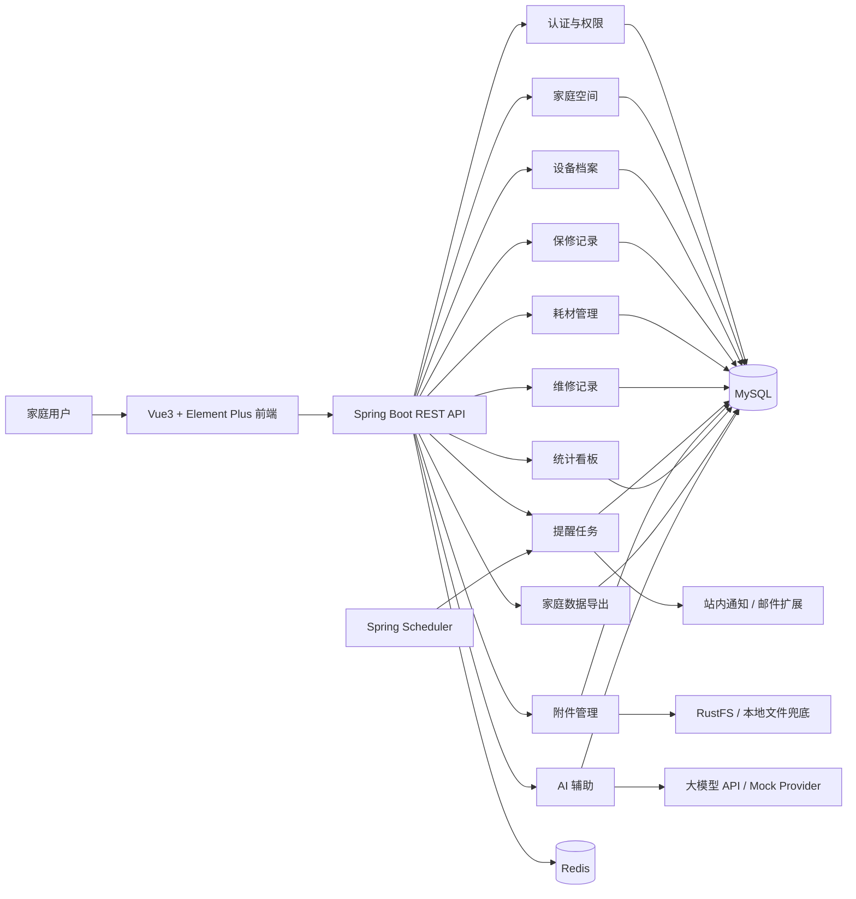
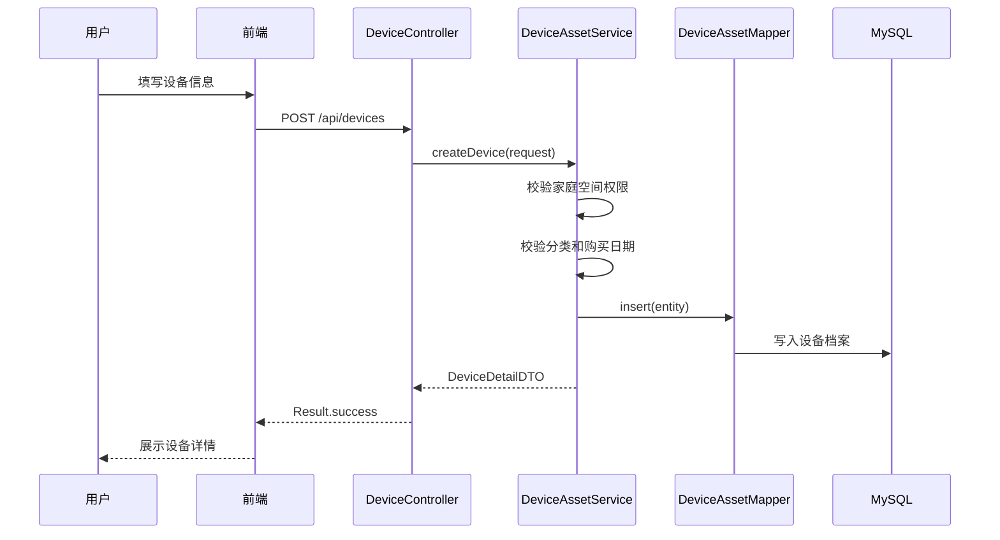
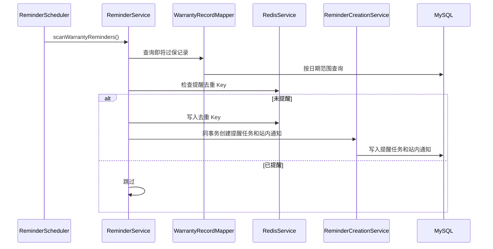
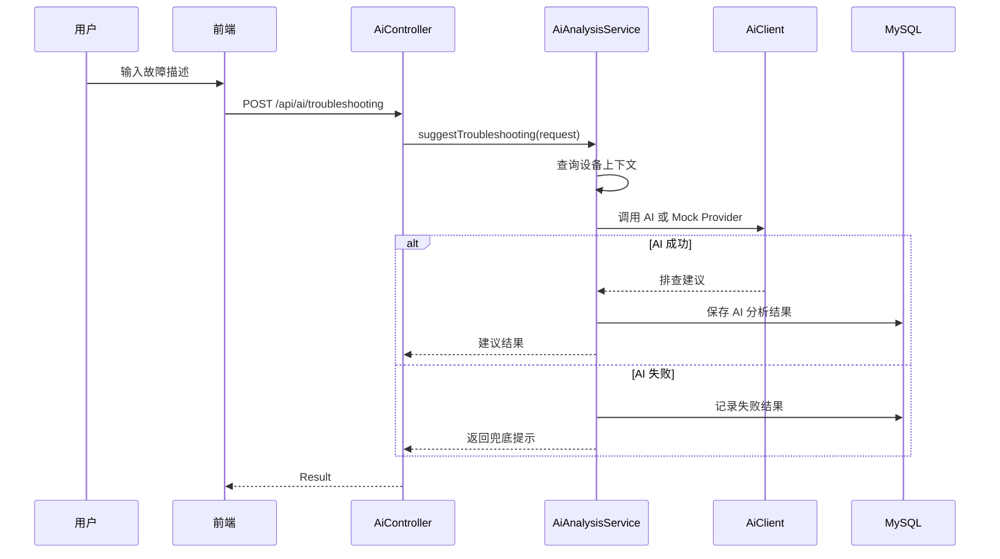

# FixLedger 架构设计

## 1. 架构目标

FixLedger 采用前后端分离架构，目标是用相对标准的 Java Web 技术栈实现一个清晰、可维护、可扩展的家庭设备保修与耗材管理系统。

架构设计重点：

- 业务定位清晰：围绕家庭设备生命周期管理。
- 模块边界清晰：设备、保修、耗材、维修、提醒、附件、导出、AI 分离。
- 核心业务稳定：AI、通知、文件存储等外部能力不能影响核心数据保存。
- 适合简历展示：覆盖 Spring Boot、MyBatis Plus、MySQL、Redis、Vue3、定时任务、文件上传、AI 辅助。
- 适合逐步实现：先完成 MVP，再系统性完善 Redis、对象存储、AI、通知、测试、安全和数据导出能力。


## 1.1 架构文档与 ADR 关系

本文件描述当前总体架构和模块设计；项目级规格见 `docs/spec.md`，关键架构取舍见 `docs/decisions/`。

当前已记录的 ADR：

- `docs/decisions/0001-core-stack-and-layering.md`：核心技术栈与分层架构。
- `docs/decisions/0002-rustfs-file-storage.md`：Docker 默认 RustFS 与 `FileStorageService` 抽象。
- `docs/decisions/0003-ai-as-auxiliary-capability.md`：AI 只作为可关闭的辅助能力。
- `docs/decisions/0004-household-scene-first-ui.md`：UI 以家庭场景优先，避免泛后台表达。

以后修改技术栈、文件存储、AI、部署、安全边界或模块职责时，必须同步更新 ADR。
## 2. 总体架构



## 3. 技术栈

### 3.1 后端

| 技术 | 版本 | 用途 |
| --- | --- | --- |
| JDK | 21+ | 后端开发语言，LTS 版本 |
| Spring Boot | 3.x | 应用框架 |
| Spring Web | 3.x | RESTful API |
| Spring Security | 6.x | 认证与授权 |
| JWT | - | 无状态登录凭证 |
| MyBatis Plus | 3.5.x | ORM 和基础 CRUD |
| MySQL | 8.x | 业务数据库 |
| Redis | 7.x | 提醒去重、JWT 黑名单、首页短 TTL 摘要缓存；验证码、用户缓存和 AI 任务状态为后续增强 |
| Spring Scheduler | - | 保修和耗材提醒定时任务 |
| Spring Validation | - | 参数校验 |
| MapStruct | - | DTO / Entity 转换 |
| SpringDoc OpenAPI | 2.6.x | 接口文档，访问 `/swagger-ui.html` 和 `/v3/api-docs` |
| RustFS / 本地文件存储 | - | 当前接入 RustFS 作为 S3 兼容对象存储，本地存储保留为测试和兜底 |
| 自定义 AI Client | - | Mock Provider 与 OpenAI-compatible Client，AI 默认可关闭 |
| Maven | 3.9+ | 构建工具 |

选择 JDK 21 + Spring Boot 3.x 的原因：

- JDK 21 是 LTS 版本，适合体现较新的 Java 实践。
- Spring Boot 3.x 生态成熟，常用组件适配更稳定。
- 相比 Spring Boot 4，Spring Boot 3.x 更适合先完成稳定可运行的简历项目。

### 3.2 前端

| 技术 | 版本 | 用途 |
| --- | --- | --- |
| Vue | 3.x | UI 框架 |
| TypeScript | 5.x | 类型约束 |
| Vite | 6.x | 构建工具 |
| Element Plus | 2.x | 后台组件库 |
| Pinia | 2.x | 状态管理 |
| Vue Router | 4.x | 路由管理 |
| Axios | 1.x | HTTP 请求 |
| ECharts | 5.x | 统计图表 |
| Day.js | 1.x | 日期处理 |

## 4. 后端分层

```text
Controller → Service → Mapper
                ↕
        Infrastructure
```

### 4.1 Controller

职责：

- 接收 HTTP 请求。
- 参数校验。
- 权限入口。
- 调用 Service。
- 返回统一响应。

规则：

- 禁止写业务逻辑。
- 请求体使用 `@Valid`。
- 返回 `Result<T>`。
- URL 使用 `/api/{module}` 风格。

### 4.2 Service

职责：

- 业务编排。
- 状态流转。
- 事务管理。
- 跨模块调用。
- 业务异常处理。

规则：

- 事务放在 Service 层。
- 外部 API 调用不得放在事务内。
- 业务异常使用 `BusinessException`。
- 大 Service 要拆分。

### 4.3 Mapper

职责：

- 数据库读写。
- 复杂查询。
- 分页查询。

规则：

- 使用 MyBatis Plus `BaseMapper`。
- 复杂 SQL 写 XML。
- Service 不拼接 SQL。
- 查询必须带家庭空间隔离条件。

### 4.4 Infrastructure

职责：

- Redis 访问。
- 文件存储。
- AI 调用。
- 通知发送。
- 定时任务封装。

规则：

- 业务层只依赖接口，不直接耦合具体实现。
- 支持 Mock 和可替换实现。

## 5. 后端模块划分

```text
common
infrastructure
modules.auth
modules.user
modules.family
modules.asset
modules.warranty
modules.consumable
modules.maintenance
modules.reminder
modules.dashboard
modules.exporter
modules.ai
modules.system
```

### 5.1 common

通用能力：

- 统一响应 `Result<T>`。
- 全局异常处理。
- 错误码。
- 通用常量。
- 安全上下文。
- 参数校验。

### 5.2 infrastructure

基础设施：

- `RedisService`。
- `FileStorageService`。
- `AiClient`。
- `NotificationService`。
- `ReminderScheduler`。

### 5.3 auth

认证模块：

- 注册。
- 登录。
- 退出登录。
- 获取当前用户。
- Refresh Token 和多端会话为后续增强。

### 5.4 user

用户模块：

- 用户资料。
- 角色管理。
- 权限预留。

### 5.5 family

家庭空间模块：

- 家庭空间。
- 家庭成员。
- 数据隔离。

### 5.6 asset

设备档案模块：

- 设备分类。
- 设备信息。
- 设备状态。
- 设备详情聚合。

### 5.7 warranty

保修模块：

- 保修记录。
- 保修提醒配置。
- 即将过保查询。

### 5.8 consumable

耗材模块：

- 耗材项。
- 更换周期。
- 更换记录。
- 下次提醒日期计算。

### 5.9 maintenance

维修模块：

- 故障记录。
- 维修状态流转。
- 维修费用。
- 维修结果。

### 5.10 reminder

提醒模块：

- 提醒任务。
- 提醒扫描。
- 提醒去重。
- 通知记录。

### 5.11 dashboard

看板模块：

- 首页统计。
- 分类分布。
- 费用统计。
- 提醒日历。

### 5.12 exporter

家庭数据导出模块：

- 设备资产清单 CSV。
- 维修费用报表 CSV。
- 家庭成员权限校验。
- CSV 转义和公式注入防护。

当前第一版为同步下载，适合普通家庭数据规模；如果后续需要大文件、导出历史、失败重试或后台任务，再引入 `fl_export_record` 异步导出。

### 5.13 ai

AI 辅助模块：

- 票据信息提取。
- 故障排查建议。
- 维修总结。
- AI 结果记录。

### 5.14 system

系统模块当前已实现操作日志基础能力，后续可扩展字典和系统参数：

- 操作日志。
- 字典配置。
- 系统参数。

## 6. 前端架构

```text
frontend/src/
├── api
├── assets
├── components
├── layouts
├── router
├── stores
├── styles
├── types
├── utils
└── views
```

### 6.1 页面层

页面放在 `views/`：

- 登录页。
- 我的家首页（路由 `/dashboard`）。
- 设备护照 / 设备列表。
- 设备详情。
- 保修管理。
- 耗材管理。
- 维修管理。
- 凭证盒 / 附件管理。
- 智能助手 / AI 辅助页面。
- 家庭设置。

### 6.2 API 层

接口封装放在 `api/`：

- `auth.ts`。
- `family.ts`。
- `device.ts`。
- `warranty.ts`。
- `consumable.ts`。
- `maintenance.ts`。
- `reminder.ts`。
- `dashboard.ts`。
- `ai.ts`。
- `file.ts`。

页面禁止直接写 URL。

### 6.3 状态管理

Pinia Store：

- 当前已实现 `useAuthStore`，统一管理 Token、当前用户、家庭空间列表和当前家庭。
- 后续可按复杂度拆分 `useFamilyStore`、`usePermissionStore` 和 `useAppStore`。

## 7. 数据流

### 7.1 创建设备流程



### 7.2 保修提醒流程



### 7.3 AI 故障建议流程



## 8. 安全设计

### 8.1 认证

- 使用 Spring Security + JWT。
- 登录成功后返回 Access Token。
- 后端通过过滤器解析 Token 并设置用户上下文。
- 退出登录会将 JWT `jti` 写入 Redis 黑名单，使旧 Token 在过期前立即失效；Refresh Token 和多端会话为后续增强。

### 8.2 数据隔离

- 家庭空间是主要数据隔离维度。
- 设备、保修、耗材、维修、附件、提醒都要包含 `family_id`。
- 查询和更新前必须校验当前用户是否属于该家庭空间。

### 8.3 附件安全

- 上传时校验文件大小、扩展名、MIME 类型。
- 下载时校验家庭空间权限。
- 文件真实路径不直接暴露给前端。

### 8.4 AI 安全

- 不发送密码、Token、完整手机号、身份证号等敏感信息给 AI。
- AI 结果只能作为建议，不能自动覆盖核心数据。

## 9. 缓存设计

Redis 使用场景：

| 场景 | Key | TTL |
| --- | --- | --- |
| 验证码（二期） | `fixledger:captcha:{uuid}` | 5 分钟 |
| JWT 黑名单 | `fixledger:auth:blacklist:{tokenId}` | Token 剩余有效期 |
| 用户信息（二期） | `fixledger:user:profile:{userId}` | 30 分钟 |
| 提醒去重 | `fixledger:reminder:dedupe:{type}:{bizId}:{date}` | 2 天 |
| 首页摘要缓存 | `fixledger:dashboard:summary:{familyId}` | 2 分钟 |
| AI 任务状态（二期） | `fixledger:ai:task:{taskId}` | 1 小时 |

缓存原则：

- 重要业务以 MySQL 为准。
- 缓存必须设置 TTL。
- Redis Key 集中管理。
- 首页缓存完整摘要结果；设备、保修、耗材、维修事务提交后删除对应家庭缓存。

## 10. 定时任务设计

### 10.1 当前提醒扫描入口

执行频率：通过 `fixledger.reminder.scan-cron` 配置，默认每天 08:00。

当前实现：

- `ReminderScheduler` 每次扫描所有家庭空间。
- `ReminderService` 在同一次扫描中处理保修提醒和耗材提醒。
- 保修提醒覆盖即将过保和已过保。
- 耗材提醒覆盖即将更换和已逾期。
- Redis 先做短期去重，数据库再兜底校验同一业务对象同一天同一类型不重复。
- 提醒任务由 `ReminderCreationService` 写入，站内通知通过 `NotificationService`
  收敛创建；当前实现只落站内通知记录，真实邮件/Webhook 后续在该基础设施边界扩展。

### 10.2 维修待跟进扫描（二期）

当前 `MAINTENANCE_FOLLOW_UP` 只作为提醒类型预留，尚未接入定时扫描。

后续接入时的逻辑：

- 查询长时间处于待处理、已报修、维修中的记录。
- 结合家庭空间和维修状态生成待跟进提醒。
- 复用 Redis 去重和 `ReminderCreationService` 写库流程。

## 11. AI 架构

AI 模块必须支持多 Provider 和 Mock 模式。

```text
AiController
  ↓
AiAnalysisService
  ↓
AiClient 接口
  ├── MockAiClient
  ├── OpenAiCompatibleClient
  └── OtherProviderClient
```

配置示例：

```yaml
app:
  ai:
    enabled: false
    provider: mock
    base-url:
    api-key:
    model:
```

AI Prompt 放在：

```text
backend/src/main/resources/prompts/
├── invoice-parse.st
├── troubleshooting.st
└── maintenance-summary.st
```

## 12. 文件存储架构

```text
FileController
  ↓
FileResourceService
  ↓
FileStorageService
  ├── LocalFileStorageService（测试和兜底）
  └── S3FileStorageService（当前用于 RustFS，可兼容 MinIO 等 S3 服务）
```

文件元数据存 MySQL，文件内容默认存 RustFS；本地文件系统保留为测试和兜底方案。

文件访问流程：

- 前端请求下载。
- 后端校验用户和家庭空间权限。
- 后端读取文件流返回；P15 凭证盒前端使用后端下载流生成 Blob URL 做图片/PDF 预览，不直接暴露对象存储地址。对象存储临时访问 URL 仍是后续可选增强。

## 13. 部署架构

开发环境：

```text
本机 JDK 21
本机 Node.js / npm
Docker MySQL
Docker Redis
Docker RustFS 或本地文件存储
AI Mock
```

Docker 环境：

```text
Nginx + Vue 前端
Spring Boot 后端
MySQL
Redis
RustFS
```

生产环境使用独立的 `docker-compose.prod.yml`，不与本地演示编排叠加，避免 Compose 合并后保留
开发端口和默认值。生产拓扑如下：

```text
Internet
  -> Nginx Gateway :80/:443
       ├── /api/* -> Spring Boot backend:8080
       └── /*     -> Vue static frontend:80

internal network only
  ├── MySQL 8
  ├── Redis 7
  ├── RustFS
  ├── Spring Boot backend
  └── Vue static frontend
```

生产边界：

- 只有 Gateway 发布宿主机端口，HTTP 统一跳转 HTTPS。
- Gateway 不代理 Actuator、OpenAPI 和 Swagger；健康检查从容器内部访问后端。
- 后端到 MySQL 使用 Connector/J `sslMode=REQUIRED`，凭据不在容器网络中明文传输。
- TLS 证书由部署主机提供并只读挂载，仓库只保留空目录与说明，不保存私钥。
- 所有镜像使用版本标签或摘要；应用镜像通过生产环境文件指定发布版本。
- `application-prod.yml` 关闭 SQL 初始化与接口文档，启用优雅停机、转发头和 Flyway。
- 生产配置缺失或仍使用已知开发示例值时，后端在创建业务 Bean 前失败退出。

数据库迁移与数据生命周期：

- `schema.sql` 继续服务 H2 测试和本地演示初始化，生产数据库以 `db/migration` 为唯一演进入口。
- 首个 Flyway 迁移建立当前基线；已有非空数据库可在版本 0 建立基线后执行幂等迁移。
- 迁移前先备份 MySQL 与 RustFS，迁移脚本遵循只前进原则；应用回滚不自动回滚数据库结构。
- 破坏性迁移必须拆为“先兼容、再切换、后清理”多个版本，保证至少一个应用版本可回退。
- MySQL 是业务结构化数据事实来源，RustFS 是附件内容事实来源，二者必须使用同一备份批次标识。
- Redis 不纳入业务恢复点，恢复后由缓存回源、提醒扫描和去重 TTL 自然重建。

CI/CD 门禁：

```text
GitHub Actions
  ├── Backend Tests: JDK 21 + mvn -q test
  ├── Frontend Build: vue-tsc + vite dist-ci build + smoke + critical audit
  └── Compose Check: docker compose config + health dry-run + production readiness
```

`scripts/check-production-readiness.ps1` 负责检查 Docker Compose、`.env.example`、
CI 工作流、前端脚本、JDK 21 配置和关键环境变量模板，避免生产准备项散落在口头说明里。
P30 后该脚本还会解析生产 Compose 的渲染结果，检查公开端口、Profile、镜像版本、危险默认值、
迁移开关和备份恢复脚本；实际发布时必须额外传入生产环境文件并启用密钥校验。

## 14. 关键设计取舍

### 14.1 为什么不直接做企业资产系统

企业资产系统范围更大，包括采购、审批、领用、盘点、折旧、报废等流程，容易变成普通后台管理系统。FixLedger 只聚焦家庭设备的保修、维修、耗材和凭证归档，更贴近个人真实生活场景。

### 14.2 为什么 AI 不做核心

项目核心价值是设备生命周期管理。AI 只负责降低录入和整理成本。如果 AI 不可用，系统仍能完成设备、保修、耗材、维修和提醒管理。

### 14.3 为什么文件存储先抽象再接入 RustFS

第一版先用本地文件存储快速完成上传、下载和鉴权闭环。现在 Docker 演示环境接入 RustFS，文件内容进入对象存储，测试环境继续使用本地文件。通过 `FileStorageService` 抽象后，RustFS、MinIO 或其他 S3 兼容服务可以在不改业务接口的情况下替换。

### 14.4 为什么使用 Redis

Redis 当前主要用于提醒去重、JWT 退出黑名单和首页短 TTL 摘要缓存；验证码、用户资料缓存和 AI 异步任务状态是后续增强。缓存不可用时首页回源 MySQL，不影响核心业务数据模型。

## 15. 演进路线

### 阶段 1：MVP

- 账号登录。
- 家庭空间。
- 设备档案。
- 保修记录。
- 耗材管理。
- 维修记录。
- 首页看板。

### 阶段 2：工程增强

- Redis 去重和缓存。
- 定时提醒。
- 附件上传。
- 操作日志。
- Docker Compose。
- RustFS/S3 兼容对象存储。

### 阶段 3：AI 辅助

- 发票文本提取。
- 故障排查建议。
- 维修总结。

### 阶段 4：体验增强

- PDF 说明书搜索。
- 家庭数据导出（当前已完成设备清单和维修费用 CSV）。
- 移动端适配。
- 二维码标签。
- OCR 与智能归档。

## 16. P10.2 当前工程实现对齐

当前代码实现与架构文档的对齐结论：

- 后端实际版本为 Spring Boot `3.3.6`、JDK `21`、MyBatis Plus `3.5.9`、SpringDoc `2.6.0`。
- 前端实际版本为 Vue `3.5.x`、TypeScript `5.6.x`、Vite `6.0.x`、Element Plus `2.8.x`。
- Docker Compose 默认编排 `mysql`、`redis`、`rustfs`、`backend`、`frontend` 五个服务，前端 Nginx 代理 `/api` 到后端。
- 数据库初始化脚本位于 `backend/src/main/resources/db/schema.sql`，演示数据位于 `backend/src/main/resources/db/demo-data.sql`。
- Prompt 模板位于 `backend/src/main/resources/prompts/`，当前包含票据提取、故障排查和维修总结三个模板。
- 当前已新增 `modules.system` 的操作日志基础能力，包括 `sys_operation_log`、
  实体、Mapper、Service 和 `/api/system/operation-logs` 分页查询接口；字典配置仍为后续扩展。
- 当前文件存储新增 `S3FileStorageService`，Docker 默认对接 RustFS；`LocalFileStorageService` 保留为测试和兜底。
- P15 凭证盒已支持图片/PDF 在线预览，但预览数据仍通过后端鉴权接口转发，未把 RustFS/MinIO 对象 Key 或临时 URL 暴露给浏览器。
- 当前登录退出已实现 Redis Token 黑名单，Refresh Token 和多端会话机制保留为后续增强。
- 当前定时任务为 `ReminderScheduler` 单一 cron 入口，扫描所有家庭的保修和耗材提醒；维修待跟进扫描仍是后续增强。
- 当前 `NotificationService` 统一写入站内通知和外部投递 Outbox；邮件与 Webhook 由独立 Sender
  异步投递，渠道默认关闭，密钥和服务地址只从环境配置读取。
- 当前已新增 `modules.exporter` 家庭数据导出能力，设备资产清单和维修费用报表以同步 CSV 下载方式提供；导出接口仍走认证和家庭成员权限校验，并批量补齐分类名/设备名，避免 N+1 查询。
- 当前首页完整摘要使用 2 分钟 Cache-Aside 缓存，写事务提交后按家庭失效，Redis 异常时回源 MySQL。

## 18. P22 操作日志与通知抽象

P22 后，家庭协作操作开始具备最小审计闭环：

```text
FamilyController
  ↓
FamilyService
  ↓
OperationLogService
  ↓
sys_operation_log
```

当前记录范围：

- 邀请已注册用户加入家庭。
- 调整家庭成员角色。
- 移除家庭成员。

操作日志查询规则：

- 默认只返回当前登录用户所属家庭的日志。
- 显式传入 `familyId` 时，先校验当前用户是否属于该家庭。
- 查询接口使用统一分页查询对象和 `PageResponse<T>`，避免散落分页参数。

通知抽象当前只处理站内通知：

```text
ReminderCreationService
  ↓
NotificationService
  ↓
fl_notification_record
```

真实邮件和 Webhook 后续可在 `NotificationService` 后增加实现，但必须继续遵守：

- 不在代码中硬编码密钥、Webhook 地址或生产域名。
- 外部投递失败不能回滚提醒任务核心数据。
- 外部渠道调用不能扩大核心数据库事务范围。

## 17. RustFS 文件存储接入设计

RustFS 兼容 S3 API，因此后端不直接依赖 RustFS 私有协议，而是使用 AWS S3 SDK 访问对象存储。Docker 环境默认启用 `storage-type=rustfs`，测试环境继续使用 `local`。

```text
FileResourceController
  ↓
FileResourceService
  ↓
FileStorageService
  ├── S3FileStorageService（RustFS / MinIO / S3 兼容服务）
  └── LocalFileStorageService（测试和兜底）
```

对象 Key 规则：

```text
families/{familyId}/{bizType}/{yyyy}/{MM}/{uuid}.{extension}
```

配置项：

```yaml
fixledger:
  file:
    storage-type: rustfs
    local-root: ./uploads
    s3:
      endpoint: http://rustfs:9000
      access-key: fixledger
      secret-key: fixledger123
      bucket: fixledger-files
      region: us-east-1
      path-style-access: true
      create-bucket: true
```

说明：

- `storage-type=rustfs`、`s3` 或 `minio` 时启用 `S3FileStorageService`，当前 Docker 默认使用 RustFS。
- `path-style-access=true` 适配本地 RustFS、MinIO 这类 S3 兼容对象存储。
- `create-bucket=true` 时后端启动后首次上传前自动创建 Bucket。
- `fl_file_resource.storage_path` 保存对象 Key，不保存真实访问 URL，下载时仍由后端鉴权后读取对象流返回。

## 19. P27.2 PWA 基础架构

PWA 继续复用 Vue Router、JWT 鉴权和现有 REST API，不引入离线业务数据库，也不在浏览器持久化业务响应。

```text
浏览器 / 已安装 PWA
  ├── manifest.webmanifest：名称、图标、主题色、启动地址
  ├── Service Worker：离线状态页与安全静态资源
  └── Vue 应用：安装提示、网络状态、版本更新确认
            ↓
       Nginx / Spring Boot API
```

缓存策略：

- 安装阶段只预缓存离线页、应用清单和公开图标。
- 导航请求采用网络优先；网络不可用时返回离线页。
- `/api`、`/actuator`、`/swagger-ui`、`/v3/api-docs` 和非 GET 请求始终直接访问网络且不写缓存。
- 不缓存请求头包含 `Authorization` 的请求，不缓存跨域资源和业务附件。
- Service Worker 只在生产构建中注册，开发服务器不启用，避免旧缓存干扰 HMR。
- 浏览器只允许 HTTPS 或同设备 `localhost` 注册 Service Worker；手机通过普通局域网 HTTP 地址访问时仍可使用响应式页面，但不能安装 PWA。

更新策略：

- 新 Service Worker 安装完成后进入等待状态。
- 前端显示可控更新入口；用户确认后发送 `SKIP_WAITING`，控制权切换后刷新页面。
- 不自动刷新正在使用的页面，避免表单内容丢失。

## 20. P28 外部通知 Outbox

邮件与 Webhook 使用数据库 Outbox 和独立调度投递，外部网络调用不进入提醒创建事务。

```text
ReminderCreationService（事务）
  ├── fl_reminder_task
  ├── IN_APP / SENT
  └── EMAIL、WEBHOOK / PENDING
                 ↓
NotificationDeliveryScheduler（无业务事务）
  ↓
NotificationDeliveryService
  ├── 原子领取：PENDING/FAILED -> PROCESSING
  ├── EmailNotificationSender -> SMTP
  └── WebhookNotificationSender -> HTTPS Endpoint
                 ↓
       SENT 或 FAILED + next_retry_at
```

边界规则：

- `NotificationService` 只创建通知记录，不调用 SMTP 或 HTTP。
- 外部投递前通过条件更新原子领取记录，防止同一实例内重复处理，并为多实例竞争提供兜底。
- 查询只包含当前存在 Sender 的启用渠道，已关闭渠道的历史记录不会阻塞其他渠道。
- 失败后按指数退避计算 `next_retry_at`，达到最大尝试次数后保留 `FAILED` 且停止自动领取。
- `PROCESSING` 超过 `processing-timeout` 后恢复为可重试 `FAILED`；已达到上限时直接终止。
- 发送器只接收通知快照，不依赖当前用户请求上下文。
- 邮件密码、Webhook 地址和签名密钥只来自环境变量；日志不输出收件地址、端点、密钥或消息正文。
- Webhook 默认只允许 HTTPS；本地测试如需 HTTP 必须显式启用不安全地址开关。
- 所有外部渠道默认关闭，测试配置不发送真实邮件或网络请求。
- Outbox 提供至少一次投递语义；Webhook 接收方应使用 `notificationId` 做幂等去重。

## 21. P29 性能与可观测性

首页摘要采用 Cache-Aside，不把 Redis 作为业务事实来源：

```text
DashboardService.summary
  ├── 家庭成员权限校验
  ├── Redis 命中 -> 返回 DashboardSummaryResponse
  └── Redis 未命中/不可用
        -> DashboardStatisticsMapper 单次聚合查询
        -> 写入短 TTL 缓存

设备/保修/耗材/维修写事务
  -> 事务提交成功后删除 fixledger:dashboard:summary:{familyId}
```

一致性与降级规则：

- 权限校验始终在缓存读取前执行，缓存不能绕过家庭空间隔离。
- 缓存默认 TTL 为 2 分钟，读取、反序列化或写入失败均回源数据库。
- 写操作只在事务提交成功后失效缓存；事务回滚不触发无意义失效。
- 首页摘要 SQL 保持单次数据库往返，复杂聚合固定写在 MyBatis XML 中。
- 缓存指标不使用 `familyId` 标签，避免高基数指标和家庭标识泄露。

可观测性：

- Spring Boot Actuator 提供 `http.server.requests`，P29 增加首页缓存结果、回源耗时和导出结果指标。
- Prometheus Registry 随应用提供，但 `prometheus`/`metrics` 端点默认不公开。
- 生产环境只允许监控网络访问指标端点，不允许通过公开 Nginx 路由直接暴露。

导出继续使用同步 CSV，因为家庭场景通常远低于 5000 行。服务查询 `maxSyncRows + 1` 条记录，
发现超限后返回明确业务错误，不静默截断。只有持续出现超限需求时才进入异步导出阶段。
