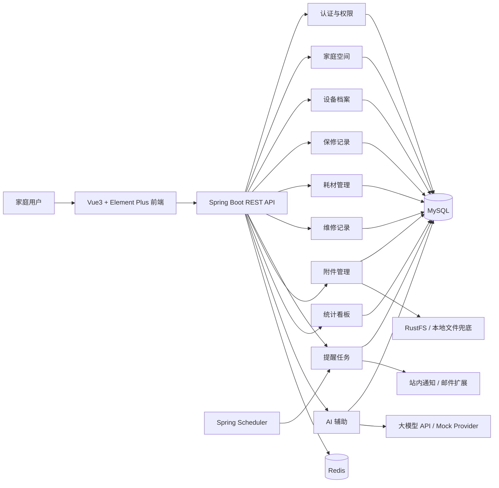
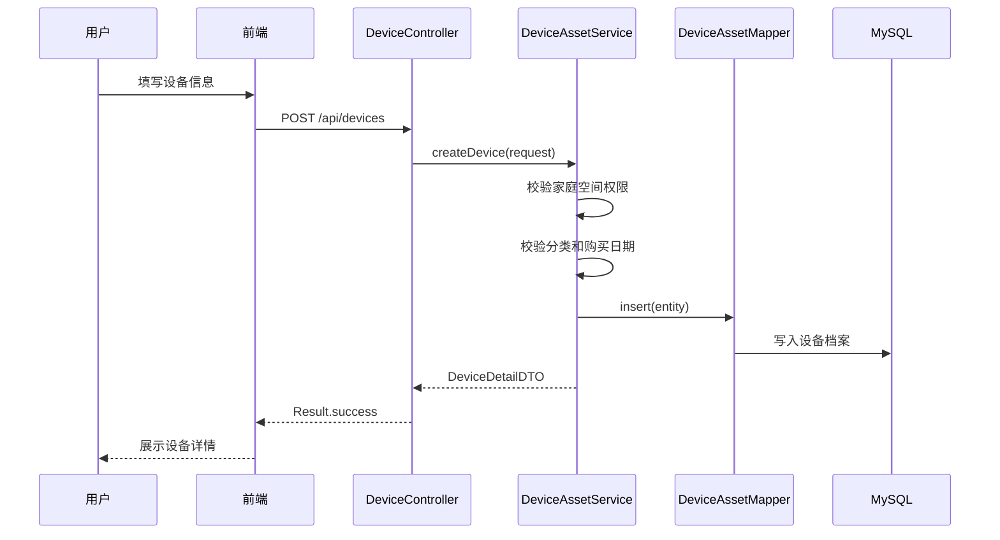
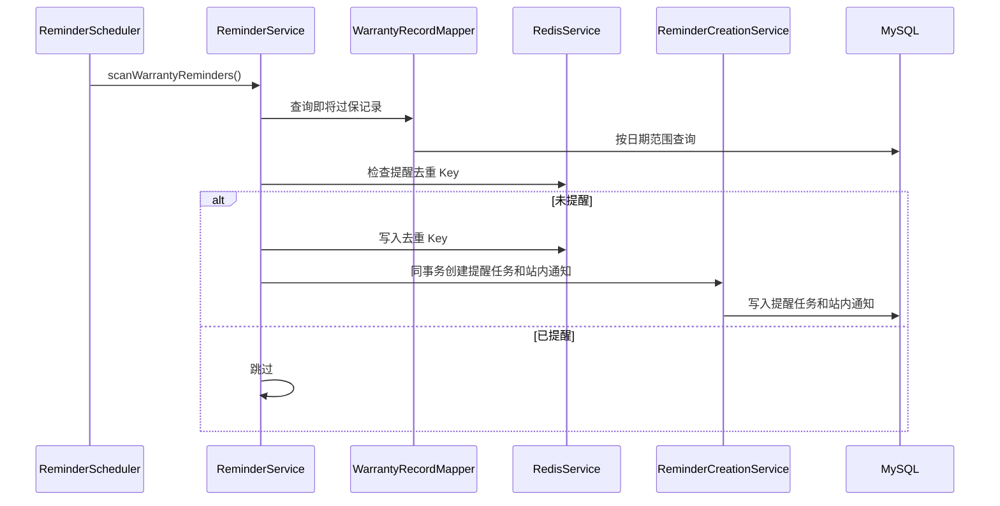
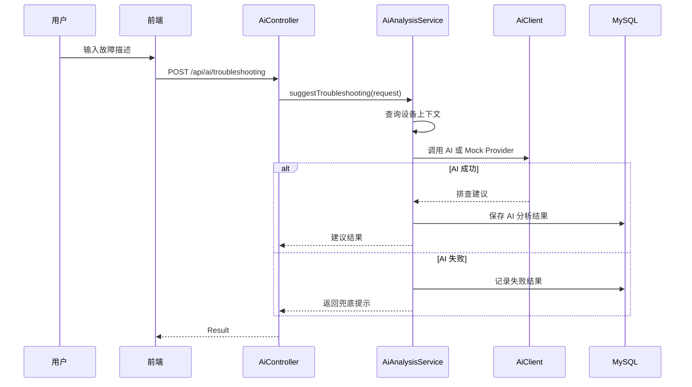

# FixLedger 架构设计

## 1. 架构目标

FixLedger 采用前后端分离架构，目标是用相对标准的 Java Web 技术栈实现一个清晰、可维护、可扩展的家庭设备保修与耗材管理系统。

架构设计重点：

- 业务定位清晰：围绕家庭设备生命周期管理。
- 模块边界清晰：设备、保修、耗材、维修、提醒、附件、AI 分离。
- 核心业务稳定：AI、通知、文件存储等外部能力不能影响核心数据保存。
- 适合简历展示：覆盖 Spring Boot、MyBatis Plus、MySQL、Redis、Vue3、定时任务、文件上传、AI 辅助。
- 适合逐步实现：先完成 MVP，再系统性完善 Redis、对象存储、AI、通知、测试和安全能力。


## 1.1 架构文档与 ADR 关系

本文件描述当前总体架构和模块设计；项目级规格见 `docs/spec.md`，关键架构取舍见 `docs/decisions/`。

当前已记录的 ADR：

- `docs/decisions/0001-core-stack-and-layering.md`：核心技术栈与分层架构。
- `docs/decisions/0002-rustfs-file-storage.md`：Docker 默认 RustFS 与 `FileStorageService` 抽象。
- `docs/decisions/0003-ai-as-auxiliary-capability.md`：AI 只作为可关闭的辅助能力。
- `docs/decisions/0004-household-scene-first-ui.md`：UI 以家庭场景优先，避免泛后台表达。

以后修改技术栈、文件存储、AI、部署、安全边界或模块职责时，必须同步更新 ADR。
## 2. 总体架构



## 3. 技术栈

### 3.1 后端

| 技术 | 版本 | 用途 |
| --- | --- | --- |
| JDK | 21+ | 后端开发语言，LTS 版本 |
| Spring Boot | 3.x | 应用框架 |
| Spring Web | 3.x | RESTful API |
| Spring Security | 6.x | 认证与授权 |
| JWT | - | 无状态登录凭证 |
| MyBatis Plus | 3.5.x | ORM 和基础 CRUD |
| MySQL | 8.x | 业务数据库 |
| Redis | 7.x | 提醒去重、JWT 黑名单、首页刷新标记/缓存钩子；验证码、用户缓存和 AI 任务状态为后续增强 |
| Spring Scheduler | - | 保修和耗材提醒定时任务 |
| Spring Validation | - | 参数校验 |
| MapStruct | - | DTO / Entity 转换 |
| SpringDoc OpenAPI | 2.6.x | 接口文档，访问 `/swagger-ui.html` 和 `/v3/api-docs` |
| RustFS / 本地文件存储 | - | 当前接入 RustFS 作为 S3 兼容对象存储，本地存储保留为测试和兜底 |
| 自定义 AI Client | - | Mock Provider 与 OpenAI-compatible Client，AI 默认可关闭 |
| Maven | 3.9+ | 构建工具 |

选择 JDK 21 + Spring Boot 3.x 的原因：

- JDK 21 是 LTS 版本，适合体现较新的 Java 实践。
- Spring Boot 3.x 生态成熟，常用组件适配更稳定。
- 相比 Spring Boot 4，Spring Boot 3.x 更适合先完成稳定可运行的简历项目。

### 3.2 前端

| 技术 | 版本 | 用途 |
| --- | --- | --- |
| Vue | 3.x | UI 框架 |
| TypeScript | 5.x | 类型约束 |
| Vite | 6.x | 构建工具 |
| Element Plus | 2.x | 后台组件库 |
| Pinia | 2.x | 状态管理 |
| Vue Router | 4.x | 路由管理 |
| Axios | 1.x | HTTP 请求 |
| ECharts | 5.x | 统计图表 |
| Day.js | 1.x | 日期处理 |

## 4. 后端分层

```text
Controller → Service → Mapper
                ↕
        Infrastructure
```

### 4.1 Controller

职责：

- 接收 HTTP 请求。
- 参数校验。
- 权限入口。
- 调用 Service。
- 返回统一响应。

规则：

- 禁止写业务逻辑。
- 请求体使用 `@Valid`。
- 返回 `Result<T>`。
- URL 使用 `/api/{module}` 风格。

### 4.2 Service

职责：

- 业务编排。
- 状态流转。
- 事务管理。
- 跨模块调用。
- 业务异常处理。

规则：

- 事务放在 Service 层。
- 外部 API 调用不得放在事务内。
- 业务异常使用 `BusinessException`。
- 大 Service 要拆分。

### 4.3 Mapper

职责：

- 数据库读写。
- 复杂查询。
- 分页查询。

规则：

- 使用 MyBatis Plus `BaseMapper`。
- 复杂 SQL 写 XML。
- Service 不拼接 SQL。
- 查询必须带家庭空间隔离条件。

### 4.4 Infrastructure

职责：

- Redis 访问。
- 文件存储。
- AI 调用。
- 通知发送。
- 定时任务封装。

规则：

- 业务层只依赖接口，不直接耦合具体实现。
- 支持 Mock 和可替换实现。

## 5. 后端模块划分

```text
common
infrastructure
modules.auth
modules.user
modules.family
modules.asset
modules.warranty
modules.consumable
modules.maintenance
modules.reminder
modules.dashboard
modules.ai
modules.system（规划中）
```

### 5.1 common

通用能力：

- 统一响应 `Result<T>`。
- 全局异常处理。
- 错误码。
- 通用常量。
- 安全上下文。
- 参数校验。

### 5.2 infrastructure

基础设施：

- `RedisService`。
- `FileStorageService`。
- `AiClient`。
- `ReminderScheduler`。
- 通知基础设施为后续扩展；当前站内通知由提醒模块的 `ReminderCreationService` 落库。

### 5.3 auth

认证模块：

- 注册。
- 登录。
- 退出登录。
- 获取当前用户。
- Refresh Token 和多端会话为后续增强。

### 5.4 user

用户模块：

- 用户资料。
- 角色管理。
- 权限预留。

### 5.5 family

家庭空间模块：

- 家庭空间。
- 家庭成员。
- 数据隔离。

### 5.6 asset

设备档案模块：

- 设备分类。
- 设备信息。
- 设备状态。
- 设备详情聚合。

### 5.7 warranty

保修模块：

- 保修记录。
- 保修提醒配置。
- 即将过保查询。

### 5.8 consumable

耗材模块：

- 耗材项。
- 更换周期。
- 更换记录。
- 下次提醒日期计算。

### 5.9 maintenance

维修模块：

- 故障记录。
- 维修状态流转。
- 维修费用。
- 维修结果。

### 5.10 reminder

提醒模块：

- 提醒任务。
- 提醒扫描。
- 提醒去重。
- 通知记录。

### 5.11 dashboard

看板模块：

- 首页统计。
- 分类分布。
- 费用统计。
- 提醒日历。

### 5.12 ai

AI 辅助模块：

- 票据信息提取。
- 故障排查建议。
- 维修总结。
- AI 结果记录。

### 5.13 system（规划中）

系统模块当前为规划方向，暂未实现独立代码包。后续可扩展：

- 操作日志。
- 字典配置。
- 系统参数。

## 6. 前端架构

```text
frontend/src/
├── api
├── assets
├── components
├── layouts
├── router
├── stores
├── styles
├── types
├── utils
└── views
```

### 6.1 页面层

页面放在 `views/`：

- 登录页。
- 我的家首页（路由 `/dashboard`）。
- 设备护照 / 设备列表。
- 设备详情。
- 保修管理。
- 耗材管理。
- 维修管理。
- 凭证盒 / 附件管理。
- 智能助手 / AI 辅助页面。
- 家庭设置。

### 6.2 API 层

接口封装放在 `api/`：

- `auth.ts`。
- `family.ts`。
- `device.ts`。
- `warranty.ts`。
- `consumable.ts`。
- `maintenance.ts`。
- `reminder.ts`。
- `dashboard.ts`。
- `ai.ts`。
- `file.ts`。

页面禁止直接写 URL。

### 6.3 状态管理

Pinia Store：

- 当前已实现 `useAuthStore`，统一管理 Token、当前用户、家庭空间列表和当前家庭。
- 后续可按复杂度拆分 `useFamilyStore`、`usePermissionStore` 和 `useAppStore`。

## 7. 数据流

### 7.1 创建设备流程



### 7.2 保修提醒流程



### 7.3 AI 故障建议流程



## 8. 安全设计

### 8.1 认证

- 使用 Spring Security + JWT。
- 登录成功后返回 Access Token。
- 后端通过过滤器解析 Token 并设置用户上下文。
- 退出登录会将 JWT `jti` 写入 Redis 黑名单，使旧 Token 在过期前立即失效；Refresh Token 和多端会话为后续增强。

### 8.2 数据隔离

- 家庭空间是主要数据隔离维度。
- 设备、保修、耗材、维修、附件、提醒都要包含 `family_id`。
- 查询和更新前必须校验当前用户是否属于该家庭空间。

### 8.3 附件安全

- 上传时校验文件大小、扩展名、MIME 类型。
- 下载时校验家庭空间权限。
- 文件真实路径不直接暴露给前端。

### 8.4 AI 安全

- 不发送密码、Token、完整手机号、身份证号等敏感信息给 AI。
- AI 结果只能作为建议，不能自动覆盖核心数据。

## 9. 缓存设计

Redis 使用场景：

| 场景 | Key | TTL |
| --- | --- | --- |
| 验证码（二期） | `fixledger:captcha:{uuid}` | 5 分钟 |
| JWT 黑名单 | `fixledger:auth:blacklist:{tokenId}` | Token 剩余有效期 |
| 用户信息（二期） | `fixledger:user:profile:{userId}` | 30 分钟 |
| 提醒去重 | `fixledger:reminder:dedupe:{type}:{bizId}:{date}` | 2 天 |
| 首页刷新标记 / 缓存钩子 | `fixledger:dashboard:summary:{familyId}` | 5 分钟 |
| AI 任务状态（二期） | `fixledger:ai:task:{taskId}` | 1 小时 |

缓存原则：

- 重要业务以 MySQL 为准。
- 缓存必须设置 TTL。
- Redis Key 集中管理。
- 当前首页写入刷新标记，为后续完整统计结果缓存预留 Key；更新设备、保修、耗材、维修数据后要考虑缓存失效。

## 10. 定时任务设计

### 10.1 当前提醒扫描入口

执行频率：通过 `fixledger.reminder.scan-cron` 配置，默认每天 08:00。

当前实现：

- `ReminderScheduler` 每次扫描所有家庭空间。
- `ReminderService` 在同一次扫描中处理保修提醒和耗材提醒。
- 保修提醒覆盖即将过保和已过保。
- 耗材提醒覆盖即将更换和已逾期。
- Redis 先做短期去重，数据库再兜底校验同一业务对象同一天同一类型不重复。
- 提醒任务和站内通知由 `ReminderCreationService` 在同一事务内写入。

### 10.2 维修待跟进扫描（二期）

当前 `MAINTENANCE_FOLLOW_UP` 只作为提醒类型预留，尚未接入定时扫描。

后续接入时的逻辑：

- 查询长时间处于待处理、已报修、维修中的记录。
- 结合家庭空间和维修状态生成待跟进提醒。
- 复用 Redis 去重和 `ReminderCreationService` 写库流程。

## 11. AI 架构

AI 模块必须支持多 Provider 和 Mock 模式。

```text
AiController
  ↓
AiAnalysisService
  ↓
AiClient 接口
  ├── MockAiClient
  ├── OpenAiCompatibleClient
  └── OtherProviderClient
```

配置示例：

```yaml
app:
  ai:
    enabled: false
    provider: mock
    base-url:
    api-key:
    model:
```

AI Prompt 放在：

```text
backend/src/main/resources/prompts/
├── invoice-parse.st
├── troubleshooting.st
└── maintenance-summary.st
```

## 12. 文件存储架构

```text
FileController
  ↓
FileResourceService
  ↓
FileStorageService
  ├── LocalFileStorageService（测试和兜底）
  └── S3FileStorageService（当前用于 RustFS，可兼容 MinIO 等 S3 服务）
```

文件元数据存 MySQL，文件内容默认存 RustFS；本地文件系统保留为测试和兜底方案。

文件访问流程：

- 前端请求下载。
- 后端校验用户和家庭空间权限。
- 后端读取文件流返回；P15 凭证盒前端使用后端下载流生成 Blob URL 做图片/PDF 预览，不直接暴露对象存储地址。对象存储临时访问 URL 仍是后续可选增强。

## 13. 部署架构

开发环境：

```text
本机 JDK 21
本机 Node.js / npm
Docker MySQL
Docker Redis
Docker RustFS 或本地文件存储
AI Mock
```

Docker 环境：

```text
Nginx + Vue 前端
Spring Boot 后端
MySQL
Redis
RustFS
```

## 14. 关键设计取舍

### 14.1 为什么不直接做企业资产系统

企业资产系统范围更大，包括采购、审批、领用、盘点、折旧、报废等流程，容易变成普通后台管理系统。FixLedger 只聚焦家庭设备的保修、维修、耗材和凭证归档，更贴近个人真实生活场景。

### 14.2 为什么 AI 不做核心

项目核心价值是设备生命周期管理。AI 只负责降低录入和整理成本。如果 AI 不可用，系统仍能完成设备、保修、耗材、维修和提醒管理。

### 14.3 为什么文件存储先抽象再接入 RustFS

第一版先用本地文件存储快速完成上传、下载和鉴权闭环。现在 Docker 演示环境接入 RustFS，文件内容进入对象存储，测试环境继续使用本地文件。通过 `FileStorageService` 抽象后，RustFS、MinIO 或其他 S3 兼容服务可以在不改业务接口的情况下替换。

### 14.4 为什么使用 Redis

Redis 当前主要用于提醒去重、JWT 退出黑名单和首页刷新标记/缓存钩子；验证码、用户资料缓存和 AI 异步任务状态是后续增强。它能体现工程能力，但不影响 MVP 的核心数据模型。

## 15. 演进路线

### 阶段 1：MVP

- 账号登录。
- 家庭空间。
- 设备档案。
- 保修记录。
- 耗材管理。
- 维修记录。
- 首页看板。

### 阶段 2：工程增强

- Redis 去重和缓存。
- 定时提醒。
- 附件上传。
- 操作日志。
- Docker Compose。
- RustFS/S3 兼容对象存储。

### 阶段 3：AI 辅助

- 发票文本提取。
- 故障排查建议。
- 维修总结。

### 阶段 4：体验增强

- 移动端适配。
- 二维码标签。
- PDF 说明书搜索。
- 家庭设备清单导出。

## 16. P10.2 当前工程实现对齐

当前代码实现与架构文档的对齐结论：

- 后端实际版本为 Spring Boot `3.3.6`、JDK `21`、MyBatis Plus `3.5.9`、SpringDoc `2.6.0`。
- 前端实际版本为 Vue `3.5.x`、TypeScript `5.6.x`、Vite `6.0.x`、Element Plus `2.8.x`。
- Docker Compose 默认编排 `mysql`、`redis`、`rustfs`、`backend`、`frontend` 五个服务，前端 Nginx 代理 `/api` 到后端。
- 数据库初始化脚本位于 `backend/src/main/resources/db/schema.sql`，演示数据位于 `backend/src/main/resources/db/demo-data.sql`。
- Prompt 模板位于 `backend/src/main/resources/prompts/`，当前包含票据提取、故障排查和维修总结三个模板。
- 当前没有独立 `modules.system` 实现，系统管理、操作日志、字典配置保留为后续扩展。
- 当前文件存储新增 `S3FileStorageService`，Docker 默认对接 RustFS；`LocalFileStorageService` 保留为测试和兜底。
- P15 凭证盒已支持图片/PDF 在线预览，但预览数据仍通过后端鉴权接口转发，未把 RustFS/MinIO 对象 Key 或临时 URL 暴露给浏览器。
- 当前登录退出已实现 Redis Token 黑名单，Refresh Token 和多端会话机制保留为后续增强。
- 当前定时任务为 `ReminderScheduler` 单一 cron 入口，扫描所有家庭的保修和耗材提醒；维修待跟进扫描仍是后续增强。
- 当前没有独立 `NotificationService` 基础设施，站内通知由 `ReminderCreationService` 与提醒任务同事务写入，邮件和 Webhook 通过后续通知基础设施扩展。
- 当前首页 Redis Key 作为刷新标记和缓存钩子使用，尚未把完整首页统计结果缓存到 Redis。

## 17. RustFS 文件存储接入设计

RustFS 兼容 S3 API，因此后端不直接依赖 RustFS 私有协议，而是使用 AWS S3 SDK 访问对象存储。Docker 环境默认启用 `storage-type=rustfs`，测试环境继续使用 `local`。

```text
FileResourceController
  ↓
FileResourceService
  ↓
FileStorageService
  ├── S3FileStorageService（RustFS / MinIO / S3 兼容服务）
  └── LocalFileStorageService（测试和兜底）
```

对象 Key 规则：

```text
families/{familyId}/{bizType}/{yyyy}/{MM}/{uuid}.{extension}
```

配置项：

```yaml
fixledger:
  file:
    storage-type: rustfs
    local-root: ./uploads
    s3:
      endpoint: http://rustfs:9000
      access-key: fixledger
      secret-key: fixledger123
      bucket: fixledger-files
      region: us-east-1
      path-style-access: true
      create-bucket: true
```

说明：

- `storage-type=rustfs`、`s3` 或 `minio` 时启用 `S3FileStorageService`，当前 Docker 默认使用 RustFS。
- `path-style-access=true` 适配本地 RustFS、MinIO 这类 S3 兼容对象存储。
- `create-bucket=true` 时后端启动后首次上传前自动创建 Bucket。
- `fl_file_resource.storage_path` 保存对象 Key，不保存真实访问 URL，下载时仍由后端鉴权后读取对象流返回。
