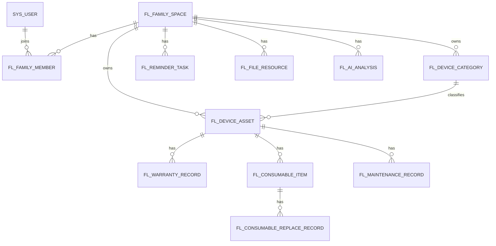

# FixLedger 数据库设计

## 1. 设计原则

数据库使用 MySQL 8，ORM 使用 MyBatis Plus。

设计原则：

- 表名使用小写下划线。
- 系统表使用 `sys_` 前缀。
- 业务表使用 `fl_` 前缀，表示 FixLedger。
- 主键统一使用 `id BIGINT`。
- 业务表优先逻辑删除。
- 家庭空间是核心数据隔离维度，需要隔离的表必须包含 `family_id`。
- 金额使用 `DECIMAL`，禁止浮点类型。
- 时间使用 `DATETIME`；Java 侧使用 `LocalDateTime`，纯日期使用 `LocalDate`。
- 附件只存元数据，文件内容默认存 RustFS；本地文件系统保留为测试和兜底。


## 1.1 表结构变更边界

数据库设计必须服务于 `docs/spec.md` 的家庭设备生命周期目标。新增或修改表结构时遵守：

- 先更新 `docs/database.md`，再修改 SQL 或 Entity。
- 需要数据隔离的业务表必须包含 `family_id` 并建立常用查询索引。
- 核心生命周期数据优先逻辑删除，不随意物理删除。
- 文件表只保存元数据和对象 Key，不保存公开访问 URL。
- 金额、日期、状态枚举和提醒时间必须能被接口文档和前端展示一致解释。
- 破坏性结构调整必须在 `docs/tasks.md` 记录迁移影响，必要时新增 ADR。
## 2. 通用字段

大部分业务表包含以下字段：

| 字段 | 类型 | 说明 |
| --- | --- | --- |
| id | BIGINT | 主键 |
| created_at | DATETIME | 创建时间 |
| updated_at | DATETIME | 更新时间 |
| created_by | BIGINT | 创建人 |
| updated_by | BIGINT | 更新人 |
| deleted | TINYINT | 逻辑删除，0 未删除，1 已删除 |

建议由 MyBatis Plus 自动填充：

- `created_at`
- `updated_at`
- `created_by`
- `updated_by`
- `deleted`

## 3. 枚举约定

### 3.1 用户状态 `user_status`

| 值 | 说明 |
| --- | --- |
| ENABLED | 启用 |
| DISABLED | 禁用 |

### 3.2 家庭成员角色 `family_role`

| 值 | 说明 |
| --- | --- |
| OWNER | 所有者 |
| MEMBER | 成员 |
| VIEWER | 只读成员 |

### 3.3 设备状态 `device_status`

| 值 | 说明 |
| --- | --- |
| NORMAL | 正常使用 |
| PENDING_REPAIR | 待维修 |
| REPAIRING | 维修中 |
| REPAIRED | 已维修 |
| IDLE | 闲置 |
| SCRAPPED | 已报废 |

### 3.4 保修类型 `warranty_type`

| 值 | 说明 |
| --- | --- |
| OFFICIAL | 官方保修 |
| EXTENDED | 延保 |
| STORE | 店铺保修 |
| OTHER | 其他 |

### 3.5 耗材状态 `consumable_status`

| 值 | 说明 |
| --- | --- |
| NORMAL | 正常 |
| DUE_SOON | 即将到期 |
| OVERDUE | 已逾期 |
| DISABLED | 停用 |

### 3.6 维修状态 `maintenance_status`

| 值 | 说明 |
| --- | --- |
| PENDING | 待处理 |
| REPORTED | 已报修 |
| REPAIRING | 维修中 |
| COMPLETED | 已完成 |
| CANCELED | 已取消 |

### 3.7 提醒类型 `reminder_type`

| 值 | 说明 |
| --- | --- |
| WARRANTY_EXPIRE_SOON | 保修即将到期 |
| WARRANTY_EXPIRED | 保修已到期 |
| CONSUMABLE_REPLACE_SOON | 耗材即将更换 |
| CONSUMABLE_OVERDUE | 耗材已逾期 |
| MAINTENANCE_FOLLOW_UP | 维修待跟进（当前类型预留，定时扫描暂未生成） |

### 3.8 提醒状态 `reminder_status`

| 值 | 说明 |
| --- | --- |
| PENDING | 待提醒 |
| SENT | 已发送 |
| READ | 已读 |
| IGNORED | 已忽略 |
| FAILED | 发送失败 |

### 3.9 附件业务类型 `file_biz_type`

| 值 | 说明 |
| --- | --- |
| DEVICE | 设备附件 |
| WARRANTY | 保修附件 |
| MAINTENANCE | 维修附件 |
| CONSUMABLE | 耗材附件 |
| MANUAL | 说明书 |

### 3.10 AI 分析类型 `ai_analysis_type`

| 值 | 说明 |
| --- | --- |
| INVOICE_PARSE | 票据信息提取 |
| TROUBLESHOOTING | 故障排查建议 |
| MAINTENANCE_SUMMARY | 维修总结 |
| CARE_SUGGESTION | 保养建议 |

## 4. 表结构设计

## 4.1 sys_user 用户表

```sql
CREATE TABLE sys_user (
  id BIGINT PRIMARY KEY AUTO_INCREMENT,
  username VARCHAR(64) NOT NULL,
  email VARCHAR(128) DEFAULT NULL,
  phone VARCHAR(32) DEFAULT NULL,
  password_hash VARCHAR(255) NOT NULL,
  nickname VARCHAR(64) DEFAULT NULL,
  avatar_url VARCHAR(512) DEFAULT NULL,
  status VARCHAR(32) NOT NULL DEFAULT 'ENABLED',
  last_login_at DATETIME DEFAULT NULL,
  created_at DATETIME NOT NULL,
  updated_at DATETIME NOT NULL,
  created_by BIGINT DEFAULT NULL,
  updated_by BIGINT DEFAULT NULL,
  deleted TINYINT NOT NULL DEFAULT 0,
  UNIQUE KEY uk_sys_user_username (username),
  UNIQUE KEY uk_sys_user_email (email),
  KEY idx_sys_user_status (status)
) ENGINE=InnoDB DEFAULT CHARSET=utf8mb4;
```

说明：

- 密码必须存储哈希值。
- 邮箱可选，但如果填写需要唯一。

## 4.2 sys_role 角色表（二期规划）

```sql
CREATE TABLE sys_role (
  id BIGINT PRIMARY KEY AUTO_INCREMENT,
  role_code VARCHAR(64) NOT NULL,
  role_name VARCHAR(64) NOT NULL,
  description VARCHAR(255) DEFAULT NULL,
  created_at DATETIME NOT NULL,
  updated_at DATETIME NOT NULL,
  created_by BIGINT DEFAULT NULL,
  updated_by BIGINT DEFAULT NULL,
  deleted TINYINT NOT NULL DEFAULT 0,
  UNIQUE KEY uk_sys_role_code (role_code)
) ENGINE=InnoDB DEFAULT CHARSET=utf8mb4;
```

## 4.3 sys_user_role 用户角色表（二期规划）

```sql
CREATE TABLE sys_user_role (
  id BIGINT PRIMARY KEY AUTO_INCREMENT,
  user_id BIGINT NOT NULL,
  role_id BIGINT NOT NULL,
  created_at DATETIME NOT NULL,
  updated_at DATETIME NOT NULL,
  created_by BIGINT DEFAULT NULL,
  updated_by BIGINT DEFAULT NULL,
  deleted TINYINT NOT NULL DEFAULT 0,
  UNIQUE KEY uk_sys_user_role (user_id, role_id),
  KEY idx_sys_user_role_role_id (role_id)
) ENGINE=InnoDB DEFAULT CHARSET=utf8mb4;
```

## 4.4 sys_operation_log 操作日志表

```sql
CREATE TABLE sys_operation_log (
  id BIGINT PRIMARY KEY AUTO_INCREMENT,
  user_id BIGINT DEFAULT NULL,
  family_id BIGINT DEFAULT NULL,
  module VARCHAR(64) NOT NULL,
  action VARCHAR(64) NOT NULL,
  biz_type VARCHAR(64) DEFAULT NULL,
  biz_id BIGINT DEFAULT NULL,
  request_method VARCHAR(16) DEFAULT NULL,
  request_uri VARCHAR(512) DEFAULT NULL,
  ip_address VARCHAR(64) DEFAULT NULL,
  success TINYINT NOT NULL DEFAULT 1,
  error_message VARCHAR(1024) DEFAULT NULL,
  created_at DATETIME NOT NULL,
  KEY idx_sys_operation_log_user_id (user_id),
  KEY idx_sys_operation_log_family (family_id),
  KEY idx_sys_operation_log_biz (biz_type, biz_id),
  KEY idx_sys_operation_log_created_at (created_at)
) ENGINE=InnoDB DEFAULT CHARSET=utf8mb4;
```

说明：

- P22 起该表进入当前实现，优先记录家庭成员邀请、角色调整、移除等关键协作操作。
- `request_uri` 只记录路径和方法，不保存请求体，避免敏感字段落入日志。
- 查询接口按当前用户家庭成员关系做数据隔离，不提供跨家庭全局后台视图。

## 4.5 fl_family_space 家庭空间表

```sql
CREATE TABLE fl_family_space (
  id BIGINT PRIMARY KEY AUTO_INCREMENT,
  name VARCHAR(128) NOT NULL,
  description VARCHAR(512) DEFAULT NULL,
  owner_user_id BIGINT NOT NULL,
  created_at DATETIME NOT NULL,
  updated_at DATETIME NOT NULL,
  created_by BIGINT DEFAULT NULL,
  updated_by BIGINT DEFAULT NULL,
  deleted TINYINT NOT NULL DEFAULT 0,
  KEY idx_fl_family_space_owner (owner_user_id)
) ENGINE=InnoDB DEFAULT CHARSET=utf8mb4;
```

## 4.6 fl_family_member 家庭成员表

```sql
CREATE TABLE fl_family_member (
  id BIGINT PRIMARY KEY AUTO_INCREMENT,
  family_id BIGINT NOT NULL,
  user_id BIGINT NOT NULL,
  role VARCHAR(32) NOT NULL,
  joined_at DATETIME NOT NULL,
  created_at DATETIME NOT NULL,
  updated_at DATETIME NOT NULL,
  created_by BIGINT DEFAULT NULL,
  updated_by BIGINT DEFAULT NULL,
  deleted TINYINT NOT NULL DEFAULT 0,
  UNIQUE KEY uk_fl_family_member (family_id, user_id),
  KEY idx_fl_family_member_user_id (user_id),
  KEY idx_fl_family_member_role (family_id, role)
) ENGINE=InnoDB DEFAULT CHARSET=utf8mb4;
```

## 4.7 fl_device_category 设备分类表

```sql
CREATE TABLE fl_device_category (
  id BIGINT PRIMARY KEY AUTO_INCREMENT,
  family_id BIGINT NOT NULL,
  name VARCHAR(64) NOT NULL,
  icon VARCHAR(128) DEFAULT NULL,
  sort_order INT NOT NULL DEFAULT 0,
  system_default TINYINT NOT NULL DEFAULT 0,
  created_at DATETIME NOT NULL,
  updated_at DATETIME NOT NULL,
  created_by BIGINT DEFAULT NULL,
  updated_by BIGINT DEFAULT NULL,
  deleted TINYINT NOT NULL DEFAULT 0,
  UNIQUE KEY uk_fl_device_category_name (family_id, name),
  KEY idx_fl_device_category_family (family_id)
) ENGINE=InnoDB DEFAULT CHARSET=utf8mb4;
```

## 4.8 fl_device_asset 设备档案表

```sql
CREATE TABLE fl_device_asset (
  id BIGINT PRIMARY KEY AUTO_INCREMENT,
  family_id BIGINT NOT NULL,
  category_id BIGINT DEFAULT NULL,
  name VARCHAR(128) NOT NULL,
  brand VARCHAR(128) DEFAULT NULL,
  model VARCHAR(128) DEFAULT NULL,
  serial_number VARCHAR(128) DEFAULT NULL,
  purchase_date DATE DEFAULT NULL,
  purchase_channel VARCHAR(128) DEFAULT NULL,
  purchase_price DECIMAL(12,2) DEFAULT NULL,
  location VARCHAR(128) DEFAULT NULL,
  status VARCHAR(32) NOT NULL DEFAULT 'NORMAL',
  cover_file_id BIGINT DEFAULT NULL,
  remark VARCHAR(1024) DEFAULT NULL,
  created_at DATETIME NOT NULL,
  updated_at DATETIME NOT NULL,
  created_by BIGINT DEFAULT NULL,
  updated_by BIGINT DEFAULT NULL,
  deleted TINYINT NOT NULL DEFAULT 0,
  KEY idx_fl_device_asset_family (family_id),
  KEY idx_fl_device_asset_list (family_id, updated_at),
  KEY idx_fl_device_asset_category (category_id),
  KEY idx_fl_device_asset_status (family_id, status),
  KEY idx_fl_device_asset_brand (family_id, brand),
  KEY idx_fl_device_asset_purchase_date (purchase_date)
) ENGINE=InnoDB DEFAULT CHARSET=utf8mb4;
```

## 4.9 fl_warranty_record 保修记录表

```sql
CREATE TABLE fl_warranty_record (
  id BIGINT PRIMARY KEY AUTO_INCREMENT,
  family_id BIGINT NOT NULL,
  device_id BIGINT NOT NULL,
  warranty_type VARCHAR(32) NOT NULL DEFAULT 'OFFICIAL',
  start_date DATE NOT NULL,
  end_date DATE NOT NULL,
  remind_days_before INT NOT NULL DEFAULT 30,
  service_phone VARCHAR(64) DEFAULT NULL,
  service_address VARCHAR(255) DEFAULT NULL,
  service_note VARCHAR(1024) DEFAULT NULL,
  created_at DATETIME NOT NULL,
  updated_at DATETIME NOT NULL,
  created_by BIGINT DEFAULT NULL,
  updated_by BIGINT DEFAULT NULL,
  deleted TINYINT NOT NULL DEFAULT 0,
  KEY idx_fl_warranty_record_family (family_id),
  KEY idx_fl_warranty_record_device (device_id),
  KEY idx_fl_warranty_record_end_date (family_id, end_date)
) ENGINE=InnoDB DEFAULT CHARSET=utf8mb4;
```

## 4.10 fl_consumable_item 耗材项表

```sql
CREATE TABLE fl_consumable_item (
  id BIGINT PRIMARY KEY AUTO_INCREMENT,
  family_id BIGINT NOT NULL,
  device_id BIGINT NOT NULL,
  name VARCHAR(128) NOT NULL,
  brand VARCHAR(128) DEFAULT NULL,
  model VARCHAR(128) DEFAULT NULL,
  cycle_days INT NOT NULL,
  last_replaced_date DATE DEFAULT NULL,
  next_remind_date DATE DEFAULT NULL,
  remind_days_before INT NOT NULL DEFAULT 7,
  status VARCHAR(32) NOT NULL DEFAULT 'NORMAL',
  enabled TINYINT NOT NULL DEFAULT 1,
  remark VARCHAR(1024) DEFAULT NULL,
  created_at DATETIME NOT NULL,
  updated_at DATETIME NOT NULL,
  created_by BIGINT DEFAULT NULL,
  updated_by BIGINT DEFAULT NULL,
  deleted TINYINT NOT NULL DEFAULT 0,
  KEY idx_fl_consumable_item_family (family_id),
  KEY idx_fl_consumable_item_device (device_id),
  KEY idx_fl_consumable_item_next_remind (family_id, next_remind_date),
  KEY idx_fl_consumable_item_status (family_id, status)
) ENGINE=InnoDB DEFAULT CHARSET=utf8mb4;
```

## 4.11 fl_consumable_replace_record 耗材更换记录表

```sql
CREATE TABLE fl_consumable_replace_record (
  id BIGINT PRIMARY KEY AUTO_INCREMENT,
  family_id BIGINT NOT NULL,
  consumable_id BIGINT NOT NULL,
  device_id BIGINT NOT NULL,
  replaced_date DATE NOT NULL,
  cost DECIMAL(12,2) DEFAULT NULL,
  note VARCHAR(1024) DEFAULT NULL,
  created_at DATETIME NOT NULL,
  updated_at DATETIME NOT NULL,
  created_by BIGINT DEFAULT NULL,
  updated_by BIGINT DEFAULT NULL,
  deleted TINYINT NOT NULL DEFAULT 0,
  KEY idx_fl_consumable_replace_family (family_id),
  KEY idx_fl_consumable_replace_consumable (consumable_id),
  KEY idx_fl_consumable_replace_device (device_id),
  KEY idx_fl_consumable_replace_date (replaced_date)
) ENGINE=InnoDB DEFAULT CHARSET=utf8mb4;
```

## 4.12 fl_maintenance_record 维修记录表

```sql
CREATE TABLE fl_maintenance_record (
  id BIGINT PRIMARY KEY AUTO_INCREMENT,
  family_id BIGINT NOT NULL,
  device_id BIGINT NOT NULL,
  title VARCHAR(128) NOT NULL,
  fault_description VARCHAR(2048) NOT NULL,
  occurred_at DATETIME DEFAULT NULL,
  status VARCHAR(32) NOT NULL DEFAULT 'PENDING',
  repair_channel VARCHAR(128) DEFAULT NULL,
  repair_contact VARCHAR(128) DEFAULT NULL,
  repair_cost DECIMAL(12,2) DEFAULT NULL,
  result_description VARCHAR(2048) DEFAULT NULL,
  completed_at DATETIME DEFAULT NULL,
  created_at DATETIME NOT NULL,
  updated_at DATETIME NOT NULL,
  created_by BIGINT DEFAULT NULL,
  updated_by BIGINT DEFAULT NULL,
  deleted TINYINT NOT NULL DEFAULT 0,
  KEY idx_fl_maintenance_family (family_id),
  KEY idx_fl_maintenance_device (device_id),
  KEY idx_fl_maintenance_status (family_id, status),
  KEY idx_fl_maintenance_occurred_at (occurred_at),
  KEY idx_fl_maintenance_completed_at (family_id, completed_at)
) ENGINE=InnoDB DEFAULT CHARSET=utf8mb4;
```

## 4.13 fl_reminder_task 提醒任务表

```sql
CREATE TABLE fl_reminder_task (
  id BIGINT PRIMARY KEY AUTO_INCREMENT,
  family_id BIGINT NOT NULL,
  user_id BIGINT DEFAULT NULL,
  reminder_type VARCHAR(64) NOT NULL,
  biz_type VARCHAR(64) NOT NULL,
  biz_id BIGINT NOT NULL,
  title VARCHAR(128) NOT NULL,
  content VARCHAR(1024) DEFAULT NULL,
  remind_at DATETIME NOT NULL,
  status VARCHAR(32) NOT NULL DEFAULT 'PENDING',
  read_at DATETIME DEFAULT NULL,
  created_at DATETIME NOT NULL,
  updated_at DATETIME NOT NULL,
  created_by BIGINT DEFAULT NULL,
  updated_by BIGINT DEFAULT NULL,
  deleted TINYINT NOT NULL DEFAULT 0,
  KEY idx_fl_reminder_family_status (family_id, status),
  KEY idx_fl_reminder_user_status (user_id, status),
  KEY idx_fl_reminder_remind_at (remind_at),
  KEY idx_fl_reminder_biz (biz_type, biz_id)
) ENGINE=InnoDB DEFAULT CHARSET=utf8mb4;
```

## 4.14 fl_notification_record 通知记录表

```sql
CREATE TABLE fl_notification_record (
  id BIGINT PRIMARY KEY AUTO_INCREMENT,
  family_id BIGINT NOT NULL,
  user_id BIGINT DEFAULT NULL,
  reminder_id BIGINT DEFAULT NULL,
  channel VARCHAR(32) NOT NULL,
  title VARCHAR(128) NOT NULL,
  content VARCHAR(1024) DEFAULT NULL,
  recipient VARCHAR(512) DEFAULT NULL,
  status VARCHAR(32) NOT NULL,
  error_message VARCHAR(1024) DEFAULT NULL,
  attempt_count INT NOT NULL DEFAULT 0,
  next_retry_at DATETIME DEFAULT NULL,
  last_attempt_at DATETIME DEFAULT NULL,
  sent_at DATETIME DEFAULT NULL,
  created_at DATETIME NOT NULL,
  updated_at DATETIME NOT NULL,
  created_by BIGINT DEFAULT NULL,
  updated_by BIGINT DEFAULT NULL,
  deleted TINYINT NOT NULL DEFAULT 0,
  KEY idx_fl_notification_family (family_id),
  KEY idx_fl_notification_user (user_id),
  KEY idx_fl_notification_status (status),
  KEY idx_fl_notification_dispatch (status, channel, next_retry_at, created_at),
  KEY idx_fl_notification_processing (status, last_attempt_at),
  KEY idx_fl_notification_sent_at (sent_at)
) ENGINE=InnoDB DEFAULT CHARSET=utf8mb4;
```

P28 字段说明：

- `recipient`：邮件收件地址快照；Webhook 使用配置标识，不保存带密钥的 URL。
- `attempt_count`：已领取的投递尝试次数，领取时原子加一。
- `next_retry_at`：失败后的下一次可领取时间；达到最大次数后为空。
- `last_attempt_at`：最近一次领取时间，超过配置时限的 `PROCESSING` 记录会自动恢复。
- `status`：`PENDING`、`PROCESSING`、`SENT`、`FAILED`。

## 4.15 fl_file_resource 文件资源表

```sql
CREATE TABLE fl_file_resource (
  id BIGINT PRIMARY KEY AUTO_INCREMENT,
  family_id BIGINT NOT NULL,
  biz_type VARCHAR(64) NOT NULL,
  biz_id BIGINT NOT NULL,
  original_name VARCHAR(255) NOT NULL,
  storage_name VARCHAR(255) NOT NULL,
  storage_path VARCHAR(1024) NOT NULL,
  content_type VARCHAR(128) NOT NULL,
  file_size BIGINT NOT NULL,
  extension VARCHAR(32) DEFAULT NULL,
  created_at DATETIME NOT NULL,
  updated_at DATETIME NOT NULL,
  created_by BIGINT DEFAULT NULL,
  updated_by BIGINT DEFAULT NULL,
  deleted TINYINT NOT NULL DEFAULT 0,
  KEY idx_fl_file_resource_family (family_id),
  KEY idx_fl_file_resource_biz (family_id, biz_type, biz_id)
) ENGINE=InnoDB DEFAULT CHARSET=utf8mb4;
```


### 4.15.1 RustFS 存储说明

接入 RustFS 后，`fl_file_resource` 表结构不需要新增字段：

- `storage_name` 保存对象文件名。
- `storage_path` 保存 RustFS Bucket 内的对象 Key，例如 `families/1/device/2026/05/uuid.pdf`。本地测试环境仍保存相对路径。
- `original_name`、`content_type`、`file_size`、`extension` 继续用于下载响应和前端展示。

文件内容存放在 RustFS Bucket，MySQL 只保存元数据。下载附件时仍由后端根据 `family_id` 校验权限，再从 RustFS 读取对象流返回，避免直接暴露对象存储地址。

## 4.16 fl_manual_text_index 说明书文本索引表

```sql
CREATE TABLE fl_manual_text_index (
  id BIGINT PRIMARY KEY AUTO_INCREMENT,
  family_id BIGINT NOT NULL,
  device_id BIGINT NOT NULL,
  file_id BIGINT NOT NULL,
  file_name VARCHAR(255) NOT NULL,
  content_text TEXT DEFAULT NULL,
  index_status VARCHAR(32) NOT NULL DEFAULT 'INDEXED',
  error_message VARCHAR(1024) DEFAULT NULL,
  created_at DATETIME NOT NULL,
  updated_at DATETIME NOT NULL,
  created_by BIGINT DEFAULT NULL,
  updated_by BIGINT DEFAULT NULL,
  deleted TINYINT NOT NULL DEFAULT 0,
  UNIQUE KEY uk_fl_manual_text_index_file (file_id),
  KEY idx_fl_manual_text_index_device (family_id, device_id),
  KEY idx_fl_manual_text_index_status (family_id, index_status)
) ENGINE=InnoDB DEFAULT CHARSET=utf8mb4;
```

说明：

- `family_id` 和 `device_id` 用于说明书搜索时做家庭空间隔离和设备范围过滤。
- `file_id` 关联 `fl_file_resource.id`，同一个说明书附件最多保留一条索引。
- `content_text` 只保存上传时可直接提取的说明书文本，第一版限制长度，不保存 OCR 识别结果。
- `index_status` 当前使用 `INDEXED` 和 `FAILED`，提取失败不影响附件上传。

## 4.17 fl_ai_analysis AI 分析结果表

```sql
CREATE TABLE fl_ai_analysis (
  id BIGINT PRIMARY KEY AUTO_INCREMENT,
  family_id BIGINT NOT NULL,
  user_id BIGINT NOT NULL,
  analysis_type VARCHAR(64) NOT NULL,
  biz_type VARCHAR(64) DEFAULT NULL,
  biz_id BIGINT DEFAULT NULL,
  provider VARCHAR(64) NOT NULL DEFAULT 'mock',
  model VARCHAR(128) DEFAULT NULL,
  input_summary VARCHAR(1024) DEFAULT NULL,
  result_json TEXT DEFAULT NULL,
  status VARCHAR(32) NOT NULL,
  error_message VARCHAR(1024) DEFAULT NULL,
  created_at DATETIME NOT NULL,
  updated_at DATETIME NOT NULL,
  created_by BIGINT DEFAULT NULL,
  updated_by BIGINT DEFAULT NULL,
  deleted TINYINT NOT NULL DEFAULT 0,
  KEY idx_fl_ai_analysis_family (family_id),
  KEY idx_fl_ai_analysis_user (user_id),
  KEY idx_fl_ai_analysis_biz (biz_type, biz_id),
  KEY idx_fl_ai_analysis_type (analysis_type)
) ENGINE=InnoDB DEFAULT CHARSET=utf8mb4;
```

## 5. 表关系



## 6. 索引设计说明

### 6.1 家庭空间隔离索引

所有需要家庭隔离的业务表都要有 `family_id` 索引：

- `fl_device_asset.family_id`
- `fl_warranty_record.family_id`
- `fl_consumable_item.family_id`
- `fl_maintenance_record.family_id`
- `fl_reminder_task.family_id`
- `fl_file_resource.family_id`

### 6.2 常用筛选索引

- 设备列表：默认排序使用 `family_id + updated_at`，筛选使用 `family_id + status`、
  `family_id + brand`、`category_id`。
- 保修提醒：`family_id + end_date`。
- 耗材提醒：`family_id + next_remind_date`。
- 维修列表：`family_id + status`、`device_id`。
- 提醒列表：`family_id + status`、`user_id + status`。

## 7. 数据隔离规则

- 当前用户只能访问自己所属家庭空间的数据。
- 查询业务数据时必须带 `family_id` 条件。
- 更新或删除数据前必须校验数据所属 `family_id`。
- 附件下载必须校验 `family_id`。
- AI 分析结果也必须归属家庭空间。

## 8. 逻辑删除规则

使用 `deleted` 字段。

需要逻辑删除的表：

- 设备。
- 保修记录。
- 耗材项。
- 耗材更换记录。
- 维修记录。
- 附件资源。
- AI 分析结果。

不建议物理删除核心业务数据，因为设备生命周期记录需要可追溯。

## 9. 初始化数据

### 9.1 系统角色（二期规划）

当前版本暂未创建 `sys_role` 和 `sys_user_role`，系统角色作为 RBAC 二期规划。

| role_code | role_name |
| --- | --- |
| ADMIN | 系统管理员 |
| USER | 普通用户 |

### 9.2 默认设备分类

每个家庭空间创建后都会初始化默认设备分类；演示数据也会保持同名分类可重复初始化：

- 数码设备。
- 大家电。
- 小家电。
- 网络设备。
- 厨房设备。
- 清洁设备。
- 家居设备。
- 其他。


## 10. P7 演示数据

P7 增加 `backend/src/main/resources/db/demo-data.sql` 和 `backend/src/main/resources/db/schema.sql`，用于本地 Docker 或开发环境演示。默认不会在普通开发启动时执行，只有设置以下环境变量时才会加载：

```dotenv
SQL_INIT_MODE=always
SQL_DATA_LOCATIONS=classpath:db/demo-data.sql
```

演示数据包含：

| 数据 | 说明 |
| --- | --- |
| 默认用户 | `demo / fixledger123` |
| 默认家庭空间 | `演示家庭`，`family_id=1` |
| 设备分类 | 厨房设备、清洁设备、数码设备 |
| 示例设备 | 小米净水器、戴森吸尘器、华硕路由器 |
| 保修记录 | 覆盖正常保修和即将到期保修 |
| 耗材记录 | 覆盖滤芯、滤网和更换历史 |
| 维修记录 | 覆盖已完成维修和维修中记录 |
| 提醒与通知 | 覆盖耗材即将更换和保修即将到期 |
| AI 分析 | 覆盖 Mock 故障排查建议留痕；接口测试可能额外产生票据解析记录 |

演示 SQL 使用固定主键和 `ON DUPLICATE KEY UPDATE`，方便重复执行；真实生产环境不应启用演示数据初始化。

### 10.1 P14 演示数据地图

P14 在不改变表结构的前提下，把现有演示数据整理成可讲解的数据地图。演示数据以 2026 年 5 月为基准时间，适合展示保修、耗材、维修和提醒闭环；如果当前日期偏离较远，可以使用已初始化提醒记录或手动扫描接口说明机制。

| 主键 | 数据 | 演示重点 |
| --- | --- | --- |
| `sys_user.id=1` | `demo / fixledger123` | 演示账号来自初始化 SQL，登录页只提供一键填入按钮 |
| `fl_family_space.id=1` | `演示家庭` | 所有核心业务数据按 `family_id=1` 隔离 |
| `fl_device_asset.id=1` | `小米净水器 S1` | 设备详情聚合保修、滤芯、维修、发票附件和维护总结 |
| `fl_device_asset.id=2` | `戴森吸尘器 V12` | 清洁设备、保修卡附件和 HEPA 滤网即将更换 |
| `fl_device_asset.id=3` | `华硕路由器 AX86U` | 维修中设备、即将过保和 Mock AI 故障建议 |
| `fl_reminder_task.id=1` | HEPA 滤网耗材提醒 | 演示耗材提醒和站内通知 |
| `fl_reminder_task.id=2` | 路由器保修提醒 | 演示保修即将到期和家庭日历 |
| `fl_ai_analysis.id=1` | 路由器故障建议 | 演示 AI 留痕和辅助定位 |

演示附件注意事项：`fl_file_resource` 中的记录是附件元数据样例，真实文件对象需要通过上传接口写入 RustFS。演示时可以展示附件列表、上传流程和鉴权设计；如果没有预先上传真实对象，不应把下载成功作为演示验收条件。


## 11. 后续扩展表

### 11.1 fl_device_qrcode 设备二维码表

用于生成设备标签二维码。

### 11.2 fl_webhook_config Webhook 配置表

用于扩展外部通知。

### 11.3 fl_export_record 导出记录表

用于未来异步导出家庭设备清单和维修费用报表。P29 保留同步 5000 行上限，不新建该表；
当真实家庭数据持续超过同步阈值时，再按 `PENDING -> PROCESSING -> SUCCEEDED/FAILED`
状态流转落表，并记录文件资源、尝试次数、下次重试时间和失败原因。

## 12. P10.3 当前表结构对齐说明

截至 P10.3 数据库复核，当前实际初始化脚本位于 `backend/src/main/resources/db/schema.sql`，该脚本是当前表结构的准确信息来源。已建表如下：

- `sys_user`
- `fl_family_space`
- `fl_family_member`
- `fl_device_category`
- `fl_device_asset`
- `fl_warranty_record`
- `fl_file_resource`
- `fl_manual_text_index`
- `fl_consumable_item`
- `fl_consumable_replace_record`
- `fl_maintenance_record`
- `fl_reminder_task`
- `fl_notification_record`
- `fl_ai_analysis`
- `sys_operation_log`

当前暂未实现的规划表：

- `sys_role`
- `sys_user_role`
- `fl_device_qrcode`
- `fl_webhook_config`
- `fl_export_record`

说明：这些表在文档中保留为二期 RBAC、操作审计和系统管理扩展，不属于当前 `schema.sql` 已创建表。

当前 `demo-data.sql` 提供用户、家庭、设备分类、设备、保修、耗材、更换记录、维修记录、提醒、通知、附件和 AI 分析示例数据，能够支撑面试演示核心闭环；实际数据库内容以本地是否启用 `SQL_INIT_MODE=always` 为准。

RustFS 接入后无需新增表字段，`fl_file_resource.storage_path` 保存对象 Key；下载仍由后端校验 `family_id` 后转发对象流。
